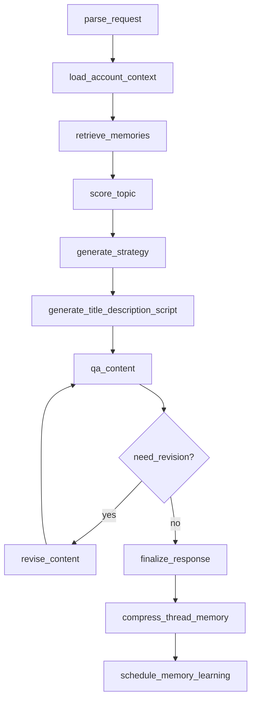

# AI Agent 服务端架构设计

版本：v0.1  
适用范围：`backend/app` Python 服务端  
核心技术：FastAPI、LangGraph、LangChain、PostgreSQL、MongoDB、Milvus、Redis

## 1. 设计目标

VO Mate 的 Agent 不是通用聊天机器人，而是围绕创作者内容工作流的可解释 AI 编排层。服务端需要把历史数据、平台上下文、向量记忆、内容生成、质检、复盘和学习串成闭环。

第一版目标：

- 用 LangGraph 编排可控、可恢复、可调试的内容生产流程。
- 用 LangChain 封装模型调用、Prompt、结构化输出和工具适配。
- 保持 FastAPI router、service、repository 分层清晰。
- 所有 AI 输出必须绑定证据、步骤和推断说明。
- 长期记忆以 PostgreSQL 为主记录，以 Milvus 做语义召回索引。
- 不做完全自治的黑盒多 Agent；Agent 角色先落成明确的 graph node。

## 2. 分层原则

```text
FastAPI Router
  只负责 HTTP 入参、响应模型、错误转换

Application Service
  创建 run、调用 graph、保存结果、组织 API response

Agent Runtime
  LangGraph 编译、执行、stream、resume、checkpoint

Graph Nodes
  可复用的窄职责节点：召回、评分、生成、质检、压缩

LangChain Chains
  Prompt、ChatModel、结构化输出 parser、工具调用

Domain Services / Repositories
  工作区、内容、记忆、采集、指标等业务数据读写

Storage
  PostgreSQL、MongoDB、Milvus、Redis
```

约束：

- Router 不直接调用 LangChain 或数据库。
- LangGraph state 不保存大段原始数据，只保存当前运行必要的轻量状态和引用 ID。
- Milvus 不作为主数据库，只保存向量和检索 metadata；完整记录回查 PostgreSQL。
- 生成节点和质检节点分离，召回节点和生成节点分离。
- 需要用户确认的节点必须显式建模为中断或 `requires_action` 状态。

## 3. 推荐目录结构

```text
backend/app/
  api/v1/
    agent.py
    ai.py

  schemas/
    agent.py
    ai.py
    memory.py

  services/
    agent_workbench_service.py
    ai_provider_service.py
    memory_record_service.py
    agent_store_service.py

  agents/
    __init__.py

    runtime/
      graph_runner.py
      checkpoint.py
      events.py
      state.py

    graphs/
      content_creation_graph.py
      memory_learning_graph.py
      review_graph.py

    nodes/
      parse_request.py
      load_context.py
      retrieve_memories.py
      score_topic.py
      generate_strategy.py
      generate_title.py
      generate_script.py
      qa_content.py
      revise_content.py
      finalize.py
      compress_thread.py
      schedule_learning.py

    chains/
      strategy_chain.py
      title_chain.py
      script_chain.py
      qa_chain.py
      summary_chain.py
      memory_extract_chain.py

    tools/
      memory_search_tool.py
      content_lookup_tool.py
      analytics_tool.py
      platform_policy_tool.py

    prompts/
      strategy.md
      title.md
      script.md
      qa.md
      memory_extract.md

    policies/
      routing.py
      scoring.py
      evidence.py
```

当前 `app/services/agent_workbench_service.py` 已经具备顺序编排雏形，后续应渐进迁移到 `app/agents/`，不要一次性重写 API 契约。

## 4. LangGraph 与 LangChain 边界

LangGraph 负责流程：

- 节点顺序和条件分支。
- checkpoint、resume、interrupt。
- 节点级 stream event。
- 失败重试和节点重跑。
- run step 调试记录。

LangChain 负责模型调用：

- PromptTemplate / ChatPromptTemplate。
- ChatModel provider 适配。
- Pydantic 结构化输出。
- Tool / Runnable 组合。
- JSON 输出校验和修复。

应用服务负责产品语义：

- 创建 `agent_run`。
- 校验 workspace、member、account。
- 调用 graph runner。
- 保存 run、step、retrieval trace、thread summary。
- 组装 `AgentWorkbenchResponse`。

## 5. Graph State 设计

Graph state 是一次 Agent 运行中的短期状态。不要把完整历史、ASR 全文、评论原文、MongoDB raw JSON、长期记忆全文塞进 state。

推荐结构：

```python
from typing import Any, TypedDict


class ContentCreationState(TypedDict, total=False):
    run_id: str
    thread_id: str
    workspace_id: str
    member_id: str
    account_id: str

    request: dict[str, Any]
    topic_brief: dict[str, Any]
    account_context: dict[str, Any]

    retrieval_queries: list[dict[str, Any]]
    evidence: list[dict[str, Any]]
    scores: dict[str, Any]

    strategy: dict[str, Any]
    drafts: dict[str, Any]
    qa_report: dict[str, Any]
    revision_count: int

    final_response: dict[str, Any]
    errors: list[dict[str, Any]]
```

大对象只在 state 中保存引用：

```text
contentId
memoryId
rawDocumentId
generationId
```

节点需要详细内容时，通过 service 或 repository 读取。

## 6. 主图：ContentCreationGraph

`ContentCreationGraph` 负责用户在线等待的内容生产链路：选题、标题、简介、脚本、质检和最终输出。



### 6.1 节点职责

| 节点 | 职责 |
| --- | --- |
| `parse_request` | 提取任务类型、平台、选题、时长、约束 |
| `load_account_context` | 加载 workspace、账号、人设、粉丝画像、平台配置、thread summary |
| `retrieve_memories` | 构造 query，按 memory type 召回 Milvus，回查 PostgreSQL，形成 evidence pack |
| `score_topic` | 输出人设匹配、搜索意图、历史相似、留存、风险等结构化评分 |
| `generate_strategy` | 生成选题角度、目标人群、表达策略和风险提醒 |
| `generate_title_description_script` | 生成标题、简介、标签、口播脚本 |
| `qa_content` | 检查人设、SEO/GEO、留存、风险、转化 |
| `revise_content` | 按质检报告定向改写，不重新发散整个方向 |
| `finalize_response` | 生成最终响应，绑定证据和模型推断 |
| `compress_thread_memory` | 把本次运行压缩为 thread summary |
| `schedule_memory_learning` | 投递后台学习任务，不阻塞用户请求 |

### 6.2 Agent 角色映射

MVP 阶段不要实现自由自治的多 Agent。各角色先映射为 LangGraph node：

| 角色 | 推荐落点 |
| --- | --- |
| Context Agent | `load_account_context` |
| Memory Retriever | `retrieve_memories` |
| Topic Strategist | `generate_strategy` |
| SEO/GEO Optimizer | `generate_title_description_script` |
| Script Writer | `generate_title_description_script` |
| Persona Guardian | `qa_content` |
| Quality Inspector | `qa_content` |
| Review Learner | `memory_learning_graph` |

## 7. 后台图：MemoryLearningGraph

`MemoryLearningGraph` 负责慢任务和长期学习，不阻塞在线生成。

适合处理：

- 从历史视频生成 `content_case`。
- 从 ASR 前几秒生成 `hook_pattern`。
- 从作者简介、高表现内容和用户确认结果生成 `persona_profile`。
- 从搜索词、评论热词和平台表现生成 `search_intent`。
- 从多条视频复盘总结 `success_pattern` 和 `failure_pattern`。
- 发布后根据表现更新实验结果和策略置信度。

后台学习原则：

- 在线热路径只写必要状态和用户确认结果。
- 学习型记忆异步生成，进入 `candidate` 状态。
- 高影响记忆需要人工确认后才变为 `active`。
- 过时或低质量记忆可标记为 `deprecated` 或 `rejected`。

## 8. Run、Step、Trace 持久化

Agent 必须可追溯。服务端应记录 run、节点步骤和召回 trace。

建议数据模型：

```text
agent_runs
  run_id
  thread_id
  workflow
  status
  input_snapshot
  output_snapshot
  started_at
  finished_at
  error

agent_run_steps
  step_id
  run_id
  node_name
  status
  input_summary
  output_summary
  latency_ms
  model_name
  token_usage
  error

agent_retrieval_traces
  trace_id
  run_id
  node_name
  query
  memory_types
  filters
  top_k
  result_memory_ids
```

现有接口：

```text
GET /api/v1/agent/runs/{runId}
GET /api/v1/agent/runs/{runId}/steps
GET /api/v1/agent/runs/{runId}/retrieval-traces
GET /api/v1/agent/threads/{threadId}/summary
POST /api/v1/agent/threads/{threadId}/compress
```

## 9. Evidence Pack 设计

生成节点不能直接接收未经裁剪的原始记录。`retrieve_memories` 应输出 evidence pack。

推荐字段：

```json
{
  "memoryId": "mem_001",
  "memoryType": "success_pattern",
  "title": "职业焦虑类内容更适合给出可执行路线",
  "summary": "历史高表现内容通常先承认焦虑，再给出具体行动路径。",
  "score": 0.86,
  "sourceType": "content",
  "sourceId": "ct_7585913482206383412",
  "platform": "douyin",
  "confidence": 0.82,
  "status": "active"
}
```

要求：

- 每个关键 AI 结论应引用 `memoryId` 或 `sourceId`。
- 召回结果需要记录 query、filter、topK 和结果 ID。
- 低置信度、过时、已驳回记忆默认不进入生成上下文。
- 证据包保留摘要，不保留完整原始正文。

## 10. Checkpoint 与恢复

LangGraph checkpoint 用于：

- 页面关闭后恢复当前 thread。
- 人工确认后继续运行。
- 从失败节点重试。
- 调试时从某个节点重跑。

建议策略：

- MVP 可先使用内存或 SQLite checkpointer，仅用于开发。
- 接真实服务时使用 PostgreSQL checkpointer，必要时配合 Redis 缓存。
- checkpoint 存短期 graph state；长期事实仍以业务表和记忆表为准。

线程摘要由 `compress_thread_memory` 生成，存入 `agent_thread_summaries` 或现有 `agent_store` 替代实现。摘要保存关键决策、拒绝方向、待办事项，不保存完整对话逐字稿。

## 11. Provider 与配置

保持 `AIProviderService` 抽象，不让业务节点直接依赖某个厂商 SDK。

推荐接口：

```text
AIProviderService
  get_chat_model()
  get_embedding_model()
  get_json_chain(prompt, output_schema)
```

当前 Provider 配置见 `API.md` 的 Agent 章节：

```env
VO_MATE_LLM_PROVIDER="deepseek"
VO_MATE_DEEPSEEK_API_KEY=
VO_MATE_DEEPSEEK_BASE_URL="https://api.deepseek.com"
VO_MATE_DEEPSEEK_MODEL="deepseek-v4-flash"

VO_MATE_EMBEDDING_PROVIDER="dashscope"
VO_MATE_DASHSCOPE_API_KEY=
VO_MATE_DASHSCOPE_EMBEDDING_MODEL="text-embedding-v3"
VO_MATE_DASHSCOPE_EMBEDDING_DIMENSION=1024
```

未配置密钥时使用 mock provider，保障本地测试可运行。

## 12. 渐进落地顺序

建议按以下顺序迁移：

1. 新增 `app/agents/` 目录和 `ContentCreationState`。
2. 把 `agent_workbench_service.py` 中的私有步骤迁移为 `agents/nodes/`。
3. 用 LangGraph 复刻当前顺序流程，保持 `POST /api/v1/agent/topic-workbench/run` 响应不变。
4. 接入 step trace，记录每个 node 的输入输出摘要和耗时。
5. 增加 `need_revision` 条件分支。
6. 接入 checkpointer，支持 thread resume 和人工确认。
7. 建立 `MemoryLearningGraph`，将复盘和记忆入库移到后台。
8. 将 mock store 逐步替换为 PostgreSQL、MongoDB、Milvus 的真实 repository/service。

## 13. 禁止事项

- 不要把所有历史资料塞进 LangGraph state。
- 不要把 Milvus 当主数据库。
- 不要让一个总 Agent 黑盒决定所有流程。
- 不要让生成节点同时负责质检。
- 不要在 router 中直接写 LangChain 调用。
- 不要把真实密钥、账号、token 写入 prompt、文档或测试样例。
- 不要为了 Agent 功能提前拆成微服务；当前仍保持模块化单体。

