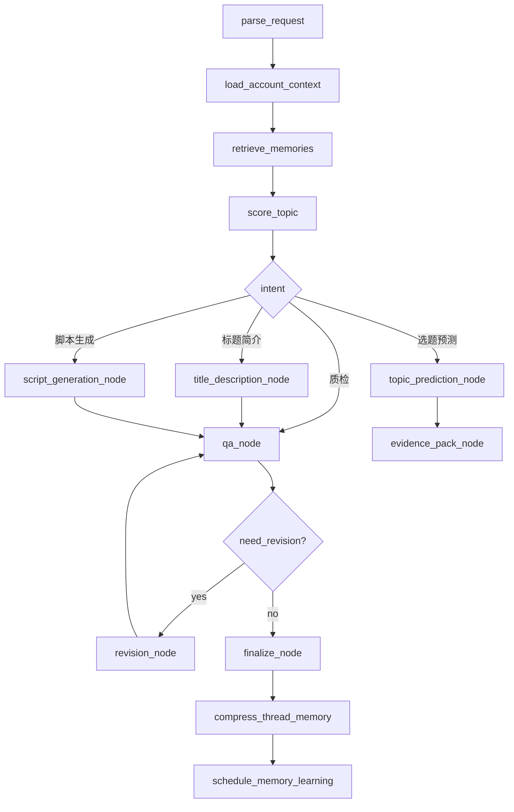

# Agent 记忆系统分析

版本：v0.1  
日期：2026-05-11  
项目：VO Mate / AI Creator Workbench  
关联文档：`docs/自媒体工作台需求分析.md`

## 1. 设计目标

自媒体工作台的 Agent 不是一次性问答工具，而是需要持续理解创作者账号、人设、历史内容、粉丝画像、搜索意图、成功失败模式，并在每次选题、生成、质检、复盘中使用这些记忆。

本系统的 Agent 记忆设计目标：

- 支持同一个内容任务的多轮协作和断点恢复。
- 支持跨任务、跨会话、跨时间的长期记忆沉淀。
- 支持从历史抖音数据中抽取内容案例、人设、开头、搜索意图、成功失败模式。
- 支持新选题生成前自动召回相关历史证据。
- 支持标题、简介、ASR 脚本、人设一致性、SEO/GEO、留存和风险质检。
- 支持记忆压缩、重连、更新、废弃和调试。
- 支持基于 LangGraph 的可控 Agent 编排，而不是不可解释的黑盒 Agent。

核心分工：

```text
LangGraph：任务编排、短期状态、断点恢复、人工确认、time travel 调试。
PostgreSQL：长期记忆主表、结构化指标、证据链、状态和审计。
Milvus：长期记忆向量索引、语义召回。
大模型：内容理解、摘要压缩、洞察总结、生成、改写、质检。
```

一句话原则：

```text
LangGraph 管“当次任务怎么走、怎么恢复”。
Milvus / PostgreSQL 管“长期内容记忆怎么沉淀、召回、评估、调试”。
```

## 2. 记忆分层

系统记忆建议分为 5 层。

### 2.1 L0：Graph State

`Graph State` 是一次 Agent 运行中的临时状态，由 LangGraph state 管理。

适合存储：

- 当前任务类型。
- 当前选题。
- 当前标题候选。
- 当前脚本版本。
- 当前质检报告。
- 当前节点执行结果。
- 当前等待用户确认的内容。

不适合存储：

- 大量历史视频全文。
- 完整 ASR 文本集合。
- 大量评论词云。
- 全量粉丝画像。
- 长期策略经验。

Graph State 是工作台，不是仓库。

### 2.2 L1：Thread Memory

`Thread Memory` 是同一个内容任务或同一个会话内的短期记忆。

示例：

```text
用户正在围绕“程序员 35 岁危机”做选题。
用户已经拒绝了“程序员彻底完了”这种焦虑标题。
用户偏好 45 秒短口播。
当前选中了“普通程序员提前看懂三条路”这个角度。
```

LangGraph 可通过 checkpointer 持久化 thread state，实现页面关闭后恢复。

推荐 thread id：

```text
thread_id = workspace_id + member_id + task_id
```

### 2.3 L2：Working Summary

`Working Summary` 是长会话压缩后的结构化摘要。

用途：

- 减少 token 消耗。
- 避免 message history 无限增长。
- 保留用户偏好、关键决策、已拒绝方向、当前任务状态。

Working Summary 可存入：

- LangGraph state。
- PostgreSQL `agent_thread_summaries`。

### 2.4 L3：Long-term Memory

`Long-term Memory` 是跨 thread、跨任务、跨时间的长期记忆。

包括：

- 历史作品案例。
- 开头钩子模式。
- 账号人设。
- 搜索意图。
- 成功模式。
- 失败模式。
- 质检规则。
- 内容实验结果。

推荐存储：

```text
PostgreSQL：保存完整结构化记录。
Milvus：保存语义向量和 metadata。
```

### 2.5 L4：Learned Policy

`Learned Policy` 是经过复盘和多次验证后沉淀出的策略。

示例：

```text
该账号职业焦虑类内容适合 45-60 秒，不适合超过 90 秒。
标题中包含“普通程序员 + 路线/选择/AI”时，搜索表现较好。
纯焦虑标题短期评论高，但近期完播下降。
人设型开头比专家型开头更符合该账号。
```

Learned Policy 更像策略层，可存在 PostgreSQL 中，并在需要时写入 Milvus 做召回。

## 3. 短期记忆压缩

### 3.1 压缩原因

Agent 与用户围绕一个选题可能多轮互动：

- 讨论角度。
- 生成标题。
- 修改标题。
- 生成简介。
- 生成脚本。
- 多轮质检。
- 用户反馈。
- 最终确认版本。

如果所有消息都原样塞进上下文，会出现：

- token 成本上升。
- 历史无关信息干扰生成。
- state 和 checkpoint 变大。
- 调试困难。

因此需要短期记忆压缩。

### 3.2 State 结构建议

建议为内容工作台定义结构化 state：

```python
class TopicWorkbenchState(TypedDict):
    messages: list
    workspace_id: str
    member_id: str
    account_id: str
    platform: str
    task_type: str
    topic_brief: dict
    retrieved_memories: list
    draft_versions: list
    qa_reports: list
    current_summary: str
    decisions: list
    rejected_ideas: list
    pending_tasks: list
```

字段说明：

| 字段 | 说明 |
| --- | --- |
| `messages` | 最近几轮原始对话 |
| `topic_brief` | 当前选题简报 |
| `retrieved_memories` | 本轮召回的记忆摘要和 ID |
| `draft_versions` | 标题、简介、脚本候选版本 |
| `qa_reports` | 质检结果 |
| `current_summary` | 压缩后的当前任务摘要 |
| `decisions` | 用户确认过的关键决策 |
| `rejected_ideas` | 用户明确否定的方向 |
| `pending_tasks` | 等待继续处理的问题 |

### 3.3 压缩策略

推荐策略：

```text
最近 6-10 轮 messages 保留原文。
更早对话压缩为 current_summary。
重要决策进入 decisions。
被否定方向进入 rejected_ideas。
生成版本进入 draft_versions。
质检报告进入 qa_reports。
召回证据只保留 memory_id + 摘要，不保留全文。
```

触发条件：

- `messages` 超过指定轮数。
- token 估算超过阈值。
- 用户完成一个阶段，例如确定选题、确定标题、确定脚本。
- Agent 即将进入大模型生成节点前。
- 当前任务需要被暂停或恢复。

### 3.4 压缩节点

LangGraph 中可定义：

```text
compress_thread_memory_node
```

输入：

- 当前 state。
- 历史 messages。
- 当前 draft。
- 当前 qa reports。
- 用户决策。

输出：

```json
{
  "topic": "程序员 35 岁危机",
  "selectedAngle": "普通程序员提前看懂三条路",
  "personaConstraints": ["普通人视角", "野生程序员", "不要大厂精英口吻"],
  "acceptedTitles": ["普通程序员别再赌技术了，35 岁前要看懂这 3 条路"],
  "rejectedIdeas": [
    {
      "idea": "程序员彻底完了",
      "reason": "焦虑过强，风险高"
    }
  ],
  "openQuestions": ["是否生成 45 秒还是 60 秒脚本"]
}
```

压缩结果应尽量结构化，避免只有一段自然语言。

## 4. 长期记忆管理

### 4.1 记忆类型

长期记忆需要按类型管理，避免召回混乱。

推荐 memory type：

| 类型 | 说明 |
| --- | --- |
| `content_case` | 历史作品案例 |
| `hook_pattern` | 开头钩子模式 |
| `persona_profile` | 账号人设 |
| `search_intent` | 搜索意图 |
| `success_pattern` | 成功模式 |
| `failure_pattern` | 失败模式 |
| `qa_rule` | 质检规则 |
| `experiment_result` | 内容实验结果 |

### 4.2 PostgreSQL 主表

建议建立 `agent_memory_records`。

字段建议：

| 字段 | 类型 | 说明 |
| --- | --- | --- |
| `id` | string | 记忆 ID |
| `workspace_id` | string | 工作区 ID |
| `account_id` | string | 平台账号 ID |
| `platform` | string | 平台，如 douyin |
| `memory_type` | string | 记忆类型 |
| `title` | string | 记忆标题 |
| `content` | text | 记忆正文 |
| `summary` | text | 短摘要 |
| `metadata` | json | 结构化元数据 |
| `source_type` | string | 来源类型 |
| `source_ids` | json | 关联视频、任务、复盘 ID |
| `confidence` | float | 置信度 |
| `evidence_count` | int | 证据数量 |
| `status` | string | 状态 |
| `last_validated_at` | datetime/null | 最近验证时间 |
| `created_at` | datetime | 创建时间 |
| `updated_at` | datetime | 更新时间 |

示例：

```json
{
  "memoryId": "mem_xxx",
  "workspaceId": "ws_xxx",
  "accountId": "douyin_xxx",
  "memoryType": "success_pattern",
  "title": "职业焦虑类内容评论率高但完播偏弱",
  "content": "当标题包含程序员、年龄、危机、路线时，评论率通常高于账号中位数，但如果视频超过 60 秒，完播容易下滑。",
  "sourceType": "auto_review",
  "sourceIds": ["7585913482206383412"],
  "confidence": 0.82,
  "evidenceCount": 7,
  "status": "active"
}
```

### 4.3 Milvus 向量索引

Milvus 用于语义召回。Milvus 中不必保存全部业务正文，但必须保存必要 metadata。

metadata 建议：

```json
{
  "memoryId": "mem_xxx",
  "memoryType": "success_pattern",
  "workspaceId": "ws_xxx",
  "accountId": "douyin_xxx",
  "platform": "douyin",
  "topicCluster": "大龄程序员职业危机",
  "confidence": 0.82,
  "status": "active",
  "publishedAt": "2025-12-20T20:19:20+08:00"
}
```

召回后流程：

```text
Milvus 返回 memoryId 和 score。
服务端用 memoryId 回查 PostgreSQL。
PostgreSQL 返回完整结构化详情。
Agent 只接收经过裁剪的 evidence pack。
```

### 4.4 记忆状态

长期记忆不能只增不删。建议状态：

| 状态 | 说明 |
| --- | --- |
| `candidate` | 新生成，尚未验证 |
| `active` | 当前参与召回 |
| `deprecated` | 过时，不优先召回 |
| `rejected` | 被人工否认或证伪 |
| `archived` | 历史保留，不参与常规召回 |

写入流程：

```text
新记忆先 candidate。
达到 evidence_count 阈值或人工确认后 active。
长期表现不再成立后 deprecated。
明显错误或用户否认后 rejected。
历史保留但不参与召回时 archived。
```

### 4.5 置信度与衰减

记忆应有置信度，不要把单个视频得出的结论当成稳定规律。

置信度来源：

- 证据数量。
- 最近有效性。
- 用户反馈确认。
- 指标稳定性。
- 是否跨多条视频成立。

示例：

```json
{
  "memory": "职业焦虑类内容评论率高",
  "confidence": 0.84,
  "evidenceCount": 12,
  "lastValidatedAt": "2026-05-01",
  "decayPolicy": "90d"
}
```

建议定期做记忆衰减：

- 超过 90 天未验证的经验降低权重。
- 近期数据明显反向时标记为 `deprecated`。
- 用户人工否认时标记为 `rejected`。

## 5. 记忆重连

记忆重连分为两类：

- 会话恢复。
- 新任务接入历史记忆。

### 5.1 会话恢复

会话恢复由 LangGraph checkpointer 负责。

流程：

```text
用户打开历史任务。
前端传入 thread_id。
服务端加载 LangGraph checkpoint。
恢复 TopicWorkbenchState。
继续从上次节点或用户确认点执行。
```

适用场景：

- 用户关闭页面后回来继续写脚本。
- Electron 端中断后继续上传和分析。
- 长任务执行失败后重跑。
- 用户从某个历史版本继续修改。

### 5.2 新任务重连历史记忆

新任务不是从 checkpoint 恢复，而是重新连接长期记忆。

流程：

```text
用户输入选题
-> 解析 workspace_id / account_id / platform / topic
-> 加载 persona_profile
-> 按任务阶段召回 Milvus 记忆
-> 回查 PostgreSQL 形成 evidence pack
-> 进入 Agent 生成或评分
```

任务阶段与召回类型：

| 任务阶段 | 推荐召回 |
| --- | --- |
| 选题预测 | `content_case`、`search_intent`、`success_pattern`、`failure_pattern` |
| 标题生成 | `search_intent`、`content_case`、`persona_profile` |
| 简介生成 | `search_intent`、`persona_profile`、`content_case` |
| 脚本生成 | `hook_pattern`、`persona_profile`、`success_pattern`、`failure_pattern` |
| 内容质检 | `persona_profile`、`qa_rule`、`failure_pattern` |
| 内容复盘 | `content_case`、历史预测、实验结果、成功失败模式 |

### 5.3 Evidence Pack

不要把召回到的所有内容直接塞给模型。应该形成裁剪后的 evidence pack。

示例：

```json
{
  "persona": {
    "summary": "15 年野生程序员，高中学历，普通人视角，AI 自救方向",
    "avoid": ["大厂精英口吻", "鸡血成功学", "绝对化承诺"]
  },
  "similarCases": [
    {
      "memoryId": "mem_001",
      "title": "程序员可以干一辈子吗",
      "summary": "职业危机类视频，评论率高，完播偏弱",
      "metrics": {
        "playCount": 34599,
        "finishRate": 0.113454,
        "commentRate": 0.004249,
        "followCount": 25
      }
    }
  ],
  "searchIntents": [
    {
      "keyword": "程序员三条职业发展路线",
      "intent": "职业规划",
      "source": "inspire_search"
    }
  ],
  "failurePatterns": [
    {
      "memoryId": "mem_009",
      "summary": "纯焦虑标题评论高，但 60 秒以上完播容易下降"
    }
  ]
}
```

模型最终输出的建议应引用 evidence pack 中的 `memoryId`。

## 6. 热路径与后台学习

### 6.1 热路径

热路径是用户正在等待结果的路径。

热路径适合做：

- 加载账号上下文。
- 召回必要记忆。
- 生成标题、简介、脚本。
- 输出质检报告。
- 保存用户确认的版本。

热路径不适合做：

- 大批量历史视频重新总结。
- 全账号成功失败模式重算。
- 大规模 embedding 重建。
- 多轮深度复盘。

### 6.2 后台学习路径

后台学习负责把历史和发布后表现沉淀为长期记忆。

可以设计：

```text
ContentCreationGraph：在线生成图，负责选题、生成、质检。
MemoryLearningGraph：后台学习图，负责复盘、压缩、归纳、入库。
```

后台学习任务：

- 从历史视频批量生成 `content_case`。
- 从 ASR 前 5 秒生成 `hook_pattern`。
- 从作者简介和高表现内容总结 `persona_profile`。
- 从搜索词和评论热词生成 `search_intent`。
- 从多条视频复盘总结 `success_pattern` 和 `failure_pattern`。
- 发布后更新实验结果和策略置信度。

### 6.3 记忆写入原则

热路径只写必要状态：

- 用户确认的选题。
- 用户最终采用的标题。
- 最终脚本版本。
- 质检结论。
- 用户明确反馈。

后台异步写学习型记忆：

- 成功模式。
- 失败模式。
- 人设更新。
- 搜索意图更新。
- 评分权重更新。

## 7. Agent 编排

### 7.1 编排原则

第一版不建议做完全自治的多 Agent 系统。更适合用 LangGraph 定义明确节点和边，让流程可控、可调试、可复现。

原则：

- 每个节点职责窄。
- 节点输入输出结构化。
- 关键节点可单独重跑。
- 生成和质检分离。
- 召回和生成分离。
- AI 结论必须绑定证据。
- 需要用户确认的节点显式中断。

### 7.2 主图设计



### 7.3 节点职责

#### parse_request

职责：

- 识别用户意图。
- 判断任务类型。
- 提取选题、平台、目标时长、输出格式。

输出：

```json
{
  "taskType": "topic_prediction",
  "topic": "程序员 35 岁危机",
  "platform": "douyin",
  "targetDuration": 45
}
```

#### load_account_context

职责：

- 加载 workspace。
- 加载平台账号。
- 加载人设摘要。
- 加载粉丝画像。
- 加载平台配置。

#### retrieve_memories

职责：

- 按任务类型构造 query。
- 按 memory type 设置过滤条件。
- 从 Milvus 召回相似记忆。
- 回查 PostgreSQL。
- 形成 evidence pack。

#### score_topic

职责：

- 计算结构化评分。
- 不直接生成文案。
- 输出评分和证据。

评分：

```text
TopicScore =
  personaFit * 0.20
  historicalSimilarityPerformance * 0.20
  searchIntentScore * 0.20
  audienceFitScore * 0.15
  noveltyScore * 0.10
  retentionPotential * 0.10
  riskPenalty * -0.05
```

#### topic_prediction_node

职责：

- 给出表现倾向。
- 给出推荐角度。
- 给出风险提醒。
- 引用历史证据。

#### title_description_node

职责：

- 生成搜索型、争议型、人设型、干货型、故事型标题。
- 生成简介。
- 生成话题标签。
- 解释关键词覆盖。

#### script_generation_node

职责：

- 生成 45 秒、60 秒或 90 秒口播脚本。
- 按时间段拆结构。
- 保持人设口吻。
- 自然覆盖核心关键词。

#### qa_node

职责：

- 人设一致性质检。
- SEO/GEO 质检。
- 留存质检。
- 风险质检。
- 转化质检。

#### revision_node

职责：

- 根据质检报告做定向改写。
- 不重新发散整个方向。
- 保留用户已确认决策。

#### finalize_node

职责：

- 生成最终输出。
- 保存用户确认结果。
- 记录 evidence binding。

#### compress_thread_memory

职责：

- 压缩当前 thread。
- 更新 current_summary。
- 保留关键决策。

#### schedule_memory_learning

职责：

- 投递后台学习任务。
- 不阻塞用户请求。

### 7.4 推荐 Agent 角色

MVP 中这些角色可以是 LangGraph 节点，不必是真正独立 Agent。

| 角色 | 职责 |
| --- | --- |
| Context Agent | 加载账号、人设、粉丝、平台上下文 |
| Memory Retriever | 召回历史案例、开头、搜索意图、成功失败模式 |
| Topic Strategist | 做选题预测和角度拆解 |
| SEO/GEO Optimizer | 生成关键词矩阵、标题、简介、话题 |
| Script Writer | 生成 45/60/90 秒口播脚本 |
| Persona Guardian | 检查人设一致性 |
| Quality Inspector | 检查留存、风险、结构、转化 |
| Review Learner | 发布后复盘并写入长期记忆 |

编排权交给 LangGraph，避免一个总 Agent 黑盒决定所有流程。

## 8. 记忆调试

### 8.1 调试目标

记忆系统必须可调试，否则后期模型输出异常时无法判断问题来源。

常见问题：

- 召回错了。
- 召回太多。
- 召回太少。
- 压缩摘要丢失关键决策。
- prompt 塞入无关证据。
- 大模型没有引用证据。
- 旧记忆覆盖了新趋势。
- 人设记忆过时。

### 8.2 调试台功能

建议后台提供 Agent Run Detail。

展示：

- Run ID。
- Thread ID。
- Graph Version。
- 当前任务类型。
- Node Timeline。
- 每个节点输入输出。
- State Snapshot。
- Retrieved Memories。
- Prompt Context Preview。
- Model Response。
- Token Usage。
- Errors。
- Final Answer。

### 8.3 Retrieval Trace

每次召回应记录：

```json
{
  "query": "程序员 35 岁危机 普通程序员 职业路线",
  "memoryTypes": ["content_case", "search_intent", "success_pattern", "failure_pattern"],
  "filters": {
    "workspaceId": "ws_xxx",
    "accountId": "douyin_xxx",
    "platform": "douyin",
    "status": "active"
  },
  "topK": 8,
  "results": [
    {
      "memoryId": "mem_001",
      "score": 0.87,
      "title": "程序员可以干一辈子吗",
      "memoryType": "content_case"
    }
  ]
}
```

### 8.4 Prompt Context Preview

调试时应能看到最终给大模型的上下文包，包括：

- System prompt。
- 当前任务。
- 人设摘要。
- 粉丝画像摘要。
- Evidence pack。
- 用户约束。
- 输出 JSON schema。

这能判断模型是因为上下文错了，还是模型自身生成错了。

### 8.5 Evidence Binding

每个重要 AI 结论都应绑定证据。

示例：

```json
{
  "claim": "这个选题评论潜力高",
  "evidence": [
    {
      "memoryId": "mem_123",
      "reason": "相似历史视频评论率高于账号中位数"
    }
  ]
}
```

前端可以区分：

- 有证据建议。
- 模型推测。
- 用户偏好。
- 平台规则。

没有 evidence 的建议，应明确标记为模型推测。

### 8.6 Replay / Fork

LangGraph checkpoint 可用于：

- 从某个节点重跑。
- 改召回 topK 后重跑。
- 换 prompt 版本重跑。
- 换模型重跑。
- 从某个历史版本 fork 出新方案。

这对调试“为什么这次标题生成不好”非常有价值。

## 9. 记忆冲突处理

### 9.1 冲突示例

同一个账号可能同时存在：

```text
职业焦虑类内容评论率高。
职业焦虑类内容近期完播下降。
```

这不是简单矛盾，而是带条件的经验。

### 9.2 条件化记忆

记忆应携带条件：

```json
{
  "pattern": "职业焦虑类内容评论率高",
  "conditions": {
    "duration": "45-60s",
    "hookType": "反常识问题",
    "period": "2025Q4-2026Q1"
  }
}
```

另一个记忆：

```json
{
  "pattern": "纯焦虑标题近期完播下降",
  "conditions": {
    "period": "2026Q2",
    "risk": "标题承诺过强"
  }
}
```

生成时让模型看到条件，而不是简单让模型二选一。

### 9.3 冲突解决策略

优先级：

```text
近期验证过的记忆 > 旧记忆
多证据记忆 > 单证据记忆
人工确认记忆 > 自动生成记忆
同任务条件匹配记忆 > 泛化记忆
高置信度记忆 > 低置信度记忆
```

如果冲突仍然存在，输出中应提示：

```text
历史上该类选题评论潜力较高，但近期同类内容完播下降。建议保留职业焦虑主题，但降低焦虑标题强度，并把视频控制在 45 秒左右。
```

## 10. MVP 落地方案

### 10.1 第一阶段

目标：

- 建立基础 Agent 记忆架构。
- 支持选题预测和标题/脚本质检。

任务：

- 接入 LangGraph checkpointer。
- 建立 `agent_memory_records` 表。
- 建立 Milvus `memory_vectors`。
- 实现 `retrieve_memories_node`。
- 实现 `compress_thread_memory_node`。
- 实现 `qa_node`。
- 支持 content_case、persona_profile、search_intent 三类记忆。

验收：

- 同一个 thread 可恢复。
- 新选题可召回相似历史案例。
- 标题和脚本质检能引用 memoryId。
- 长会话可压缩并继续生成。

### 10.2 第二阶段

目标：

- 建立完整长期记忆生命周期。

任务：

- 增加 hook_pattern、success_pattern、failure_pattern。
- 实现后台 `MemoryLearningGraph`。
- 实现记忆状态：candidate、active、deprecated、rejected、archived。
- 实现记忆置信度。
- 实现人工确认和废弃记忆。

验收：

- 历史视频可自动沉淀成功/失败模式。
- 记忆可人工启用、停用、废弃。
- 生成时可过滤低置信度或过时记忆。

### 10.3 第三阶段

目标：

- 建立 Agent 调试与复盘闭环。

任务：

- 建立 Agent Run Detail 页面。
- 记录 Retrieval Trace。
- 记录 Prompt Context Preview。
- 支持 checkpoint replay。
- 支持从 checkpoint fork 新版本。
- 发布后对比预测和真实结果。

验收：

- 任意一次 AI 输出都能追溯证据。
- 任意一次召回都能看到 query、filter、topK、结果。
- 可以从某个历史节点重跑生成。
- 预测偏差可以进入复盘和记忆更新。

## 11. 关键注意事项

- 不要把所有历史资料塞进 LangGraph state。
- 不要把 Milvus 当主数据库。
- 不要只存向量，不存结构化证据。
- 不要把用户临时偏好误写成长期人设。
- 不要让大模型直接无证据预测爆款。
- 不要只增不删，长期记忆必须有状态和衰减。
- 不要让一个总 Agent 黑盒调度所有能力。
- 不要让生成节点同时负责质检。
- 不要忽略调试台，记忆系统如果不可调试，后期很难维护。

## 12. 关键结论

针对自媒体工作台，Agent 每次生成内容前都应该回答：

```text
我是谁的人设？
我面向谁？
过去相似内容表现怎样？
这次选题命中什么搜索意图？
有哪些历史失败模式要避开？
生成后是否符合人设、留存、SEO 和风险要求？
```

最小可行架构：

```text
LangGraph + checkpointer：短期状态、断点恢复、节点编排。
PostgreSQL agent_memory_records：长期记忆主表、证据和状态。
Milvus memory_vectors：语义召回。
compress_thread_memory_node：短期压缩。
retrieve_memories_node：阶段化召回。
qa_node：人设、SEO、留存、风险质检。
MemoryLearningGraph：后台复盘和长期记忆沉淀。
Agent Run Detail：记忆调试与重放。
```

系统真正的壁垒不是 Agent 数量，而是：

```text
记忆质量 + 证据链 + 可调试编排 + 发布后复盘闭环。
```

