# AI 自媒体工作台系统架构设计

版本：v0.1  
日期：2026-05-09  
对应需求文档：`docs/self_media_ai_workbench_srd.md`  
目标：为 AI 自媒体工作台提供可落地、可扩展、可演进的系统架构设计。

## 1. 架构目标

本系统的核心目标不是单纯生成内容，而是把创作者历史数据、多平台采集、AI Agent、向量记忆、内容工作流和复盘学习串成闭环。

架构需要满足以下要求：

- 支持多平台数据接入：抖音、快手、小红书、YouTube、视频号。
- 支持已有 MongoDB 抖音历史数据快速接入。
- 支持 AI 选题、口播、SEO、标题、简介、标签、复盘。
- 支持 Milvus 自动进化学习，让系统越用越懂账号。
- 支持 Web 工作台、Electron 采集端、浏览器插件。
- 支持后续从模块化单体平滑拆成微服务。
- 保留 Raw 数据可追溯能力。
- 支持异步任务、长任务、采集任务和 Agent 执行轨迹。

## 2. 总体架构

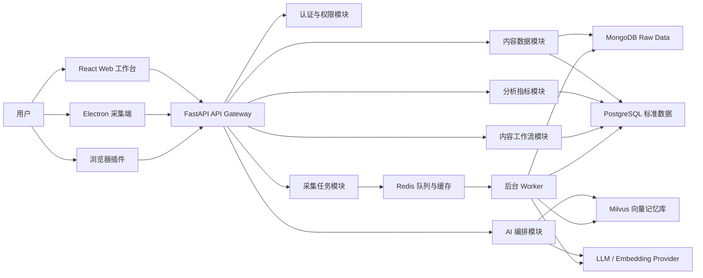

## 3. 架构风格

### 3.1 MVP 阶段

采用模块化单体：

- 一个 FastAPI 后端项目。
- 按业务域拆 Python package。
- 共享 PostgreSQL、MongoDB、Redis、Milvus。
- 长任务通过 Worker 进程执行。
- AI Agent 工作流在后端统一编排。

优点：

- 开发速度快。
- 调试简单。
- 数据模型容易调整。
- 适合先跑通抖音闭环。

### 3.2 成长期

按压力点拆服务：

- Collector Service：采集任务和采集端上传。
- AI Orchestrator Service：LangGraph 工作流和模型调用。
- Vector Service：Milvus 入库、检索和记忆管理。
- Analytics Service：指标计算和报表。
- API Gateway：统一鉴权和前端 API。

### 3.3 成熟期

演进为事件驱动架构：

- 数据采集完成后发布事件。
- ETL、指标计算、向量化、复盘 Agent 分别消费事件。
- 支持多租户、多账号、大批量内容和团队协作。

## 4. 应用分层

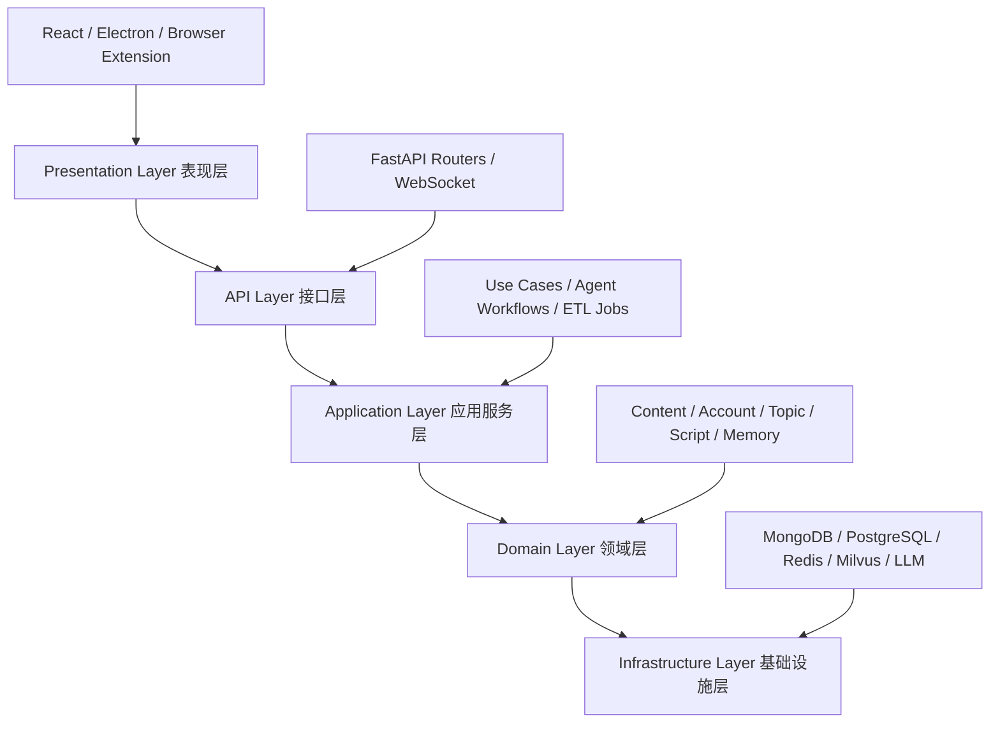

### 4.1 表现层

- React Web 工作台。
- Electron 桌面采集端。
- 浏览器插件。

### 4.2 接口层

- REST API。
- WebSocket。
- 文件上传接口。
- 采集端上传接口。
- Agent 任务状态接口。

### 4.3 应用服务层

- 内容查询服务。
- 指标分析服务。
- AI 生成服务。
- 复盘服务。
- 向量检索服务。
- 采集任务服务。
- ETL 服务。

### 4.4 领域层

- Workspace。
- PlatformAccount。
- ContentItem。
- ContentMetric。
- TopicIdea。
- ScriptDraft。
- PublishPlan。
- MemoryPattern。
- CollectorTask。

### 4.5 基础设施层

- PostgreSQL。
- MongoDB。
- Redis。
- Milvus。
- LLM Provider。
- Embedding Provider。
- Object Storage。
- Observability。

## 5. 后端模块设计

建议 FastAPI 项目采用如下结构：

```text
backend/
  app/
    main.py
    core/
      config.py
      security.py
      logging.py
      exceptions.py
    api/
      v1/
        auth.py
        workspaces.py
        platform_accounts.py
        contents.py
        analytics.py
        ai.py
        memory.py
        collector.py
        workflows.py
    domains/
      accounts/
      contents/
      analytics/
      topics/
      scripts/
      memory/
      collector/
      ai/
    services/
      etl/
      embeddings/
      langgraph/
      scoring/
      seo/
      reports/
    repositories/
      postgres/
      mongo/
      milvus/
      redis/
    workers/
      tasks.py
      pipelines.py
    schemas/
      requests/
      responses/
    tests/
```

### 5.1 Auth 模块

职责：

- 用户登录。
- JWT/session 管理。
- Workspace 权限。
- 平台账号访问控制。
- API key 管理。

核心对象：

- `User`
- `Workspace`
- `WorkspaceMember`
- `Role`
- `Permission`

### 5.2 Content 模块

职责：

- 统一内容列表。
- 内容详情。
- 多平台内容映射。
- 原始数据追溯。
- ASR 文本关联。
- 标签、关键词、流量来源关联。

核心对象：

- `ContentItem`
- `ContentTextAsset`
- `ContentTag`
- `ContentKeyword`
- `ContentTrafficSource`
- `ContentAudienceProfile`

### 5.3 Analytics 模块

职责：

- 指标计算。
- 生命周期指标。
- 日级趋势。
- 账号粉丝分析。
- 内容评分。
- 异常检测。

核心能力：

- 播放量分位数。
- 互动率。
- 完播率。
- 5 秒留存。
- 收藏率。
- 分享率。
- 涨粉转化。
- 搜索流量占比。
- 负反馈。

### 5.4 AI 模块

职责：

- LangGraph 工作流编排。
- Prompt 模板管理。
- LLM 调用。
- Tool 调用。
- 生成结果记录。
- 用户反馈回流。

核心能力：

- 选题生成。
- 选题评分。
- 口播脚本生成。
- 标题生成。
- SEO 生成。
- 多平台改写。
- 单条视频复盘。
- 周报/月报。

### 5.5 Memory 模块

职责：

- 内容向量化。
- Milvus 入库。
- 相似内容检索。
- 成功/失败模式管理。
- 记忆权重更新。
- 记忆审核。

核心对象：

- `MemoryDocument`
- `MemoryChunk`
- `MemoryPattern`
- `EmbeddingJob`
- `RetrievalResult`

### 5.6 Collector 模块

职责：

- 管理采集任务。
- 接收采集端上传。
- 记录采集日志。
- 处理 Raw 数据。
- 触发 ETL。

核心对象：

- `CollectorTask`
- `CollectorRun`
- `CollectorLog`
- `RawImportBatch`

## 6. 数据架构

## 6.1 数据分层

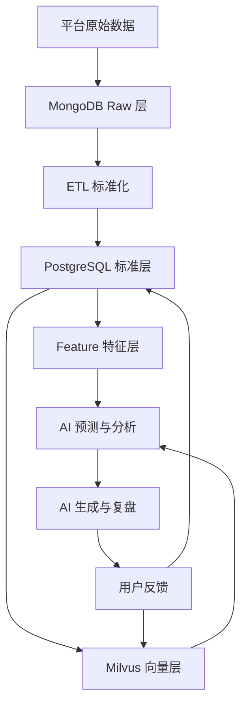

### 6.2 Raw 层

存储：MongoDB。

设计原则：

- 完整保存平台返回 JSON。
- 不强行统一字段。
- 记录采集任务、来源 URL、更新时间。
- 支持重跑 ETL。
- 支持字段变化追溯。

已有集合：

- `douyin_video_raw`
- `douyin_video_asr_results`
- `douyin_fans_summary`

未来集合：

- `kuaishou_video_raw`
- `xiaohongshu_note_raw`
- `youtube_video_raw`
- `wechat_channels_video_raw`
- `collector_raw_events`

### 6.3 标准层

存储：PostgreSQL。

目标：

- 将不同平台内容统一成相同业务模型。
- 支持查询、看板、权限、工作流。
- 支持 AI 生成记录和用户反馈。

核心表：

```text
workspaces
users
workspace_members
platform_accounts
content_items
content_text_assets
content_lifetime_metrics
content_metrics_daily
content_tags
content_keywords
content_traffic_sources
content_audience_profiles
account_fans_snapshots
account_fans_trends
topic_ideas
script_drafts
publish_plans
experiments
ai_generations
ai_feedback
memory_patterns
collector_tasks
collector_runs
```

### 6.4 特征层

存储：PostgreSQL + Redis。

特征类型：

- 内容文本特征。
- 标题结构特征。
- ASR 口播结构特征。
- 指标分位数。
- 受众匹配度。
- 搜索关键词覆盖率。
- 发布时间特征。
- 平台类型特征。
- 账号阶段特征。

用途：

- 选题评分。
- 表现预测。
- 内容推荐。
- 异常检测。
- AI 复盘依据。

### 6.5 向量层

存储：Milvus。

向量内容：

- 标题。
- 简介。
- ASR 全文。
- 分段口播。
- 评论热词。
- 搜索关键词。
- AI 复盘总结。
- 成功模式。
- 失败模式。
- 用户人设和风格。

## 7. 核心数据流

## 7.1 历史数据初始化流程

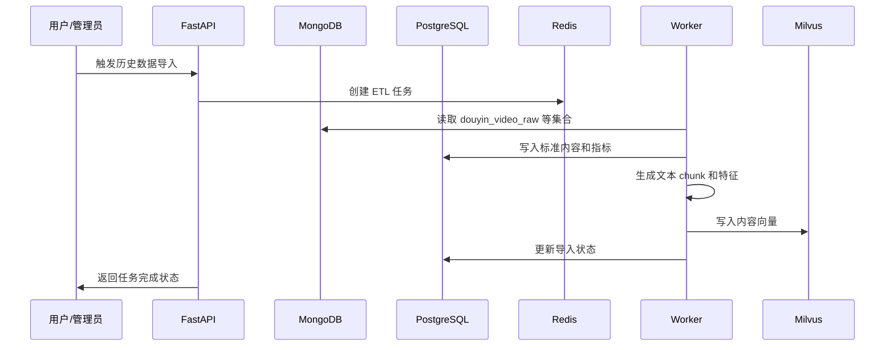

## 7.2 新数据采集流程

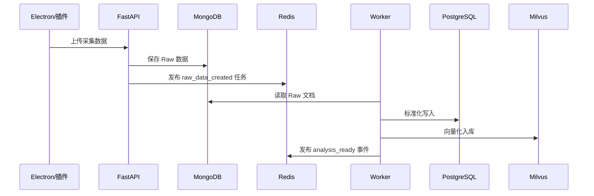

## 7.3 AI 选题流程

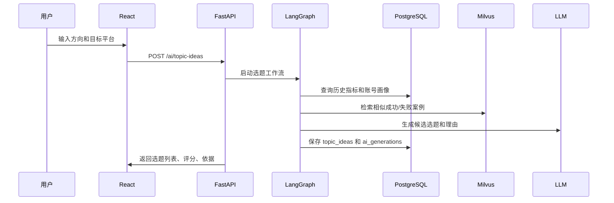

## 7.4 视频复盘学习流程

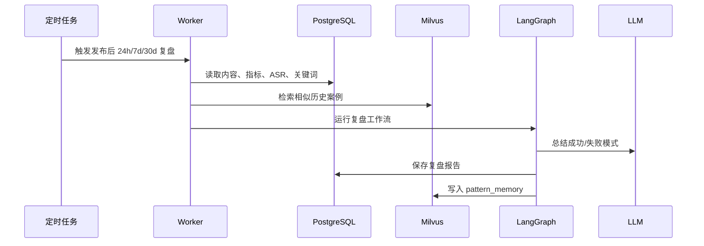

## 8. Milvus 架构设计

## 8.1 Collection 设计

### `creator_content_vectors`

用于内容级相似检索。

字段：

| 字段 | 类型 | 说明 |
| --- | --- | --- |
| `vector_id` | string | 向量主键 |
| `workspace_id` | string | 工作区 ID |
| `platform` | string | 平台 |
| `account_id` | string | 平台账号 ID |
| `content_id` | string | 标准内容 ID |
| `platform_content_id` | string | 平台内容 ID |
| `chunk_type` | string | title, desc, asr, tags, summary |
| `topic` | string | 主题 |
| `publish_time` | int64 | 发布时间 |
| `metric_score` | float | 综合表现分 |
| `is_positive_case` | bool | 是否正向案例 |
| `is_negative_case` | bool | 是否反向案例 |
| `embedding` | float_vector | 文本向量 |

### `creator_pattern_vectors`

用于成功/失败模式检索。

字段：

| 字段 | 类型 | 说明 |
| --- | --- | --- |
| `pattern_id` | string | 模式 ID |
| `workspace_id` | string | 工作区 ID |
| `platform` | string | 平台 |
| `pattern_type` | string | success, failure, seo, hook, script |
| `confidence` | float | 置信度 |
| `source_count` | int | 支撑样本数 |
| `last_verified_at` | int64 | 最近验证时间 |
| `embedding` | float_vector | 模式总结向量 |

### `creator_seo_vectors`

用于 SEO 和关键词检索。

字段：

| 字段 | 类型 | 说明 |
| --- | --- | --- |
| `keyword_id` | string | 关键词 ID |
| `workspace_id` | string | 工作区 ID |
| `platform` | string | 平台 |
| `keyword` | string | 关键词 |
| `search_score` | float | 搜索价值 |
| `conversion_score` | float | 转化价值 |
| `embedding` | float_vector | 关键词语义向量 |

### `creator_audience_vectors`

用于受众画像和兴趣检索。

字段：

| 字段 | 类型 | 说明 |
| --- | --- | --- |
| `audience_id` | string | 人群记忆 ID |
| `workspace_id` | string | 工作区 ID |
| `account_id` | string | 账号 ID |
| `platform` | string | 平台 |
| `segment_type` | string | age, gender, city, interest, career |
| `tgi` | float | 偏好指数 |
| `period` | string | 统计周期 |
| `embedding` | float_vector | 人群描述向量 |

## 8.2 向量写入策略

写入触发点：

- 历史数据导入。
- 新内容采集完成。
- ASR 结果生成。
- AI 复盘完成。
- 用户确认一条经验。
- 实验结果完成。

文本 chunk 策略：

- 标题单独 chunk。
- 简介单独 chunk。
- ASR 按语义段落 chunk。
- 评论热词聚合成 chunk。
- 搜索关键词聚合成 chunk。
- AI 总结单独 chunk。

## 8.3 检索策略

检索时必须组合：

- 向量相似度。
- workspace 过滤。
- account 过滤。
- platform 过滤。
- 正向/反向案例过滤。
- 时间衰减。
- metric_score 加权。
- pattern confidence 加权。

建议排序公式：

```text
final_score =
  0.45 * vector_similarity
+ 0.20 * metric_score
+ 0.15 * recency_score
+ 0.10 * platform_match
+ 0.10 * confidence_score
```

## 8.4 自动进化机制

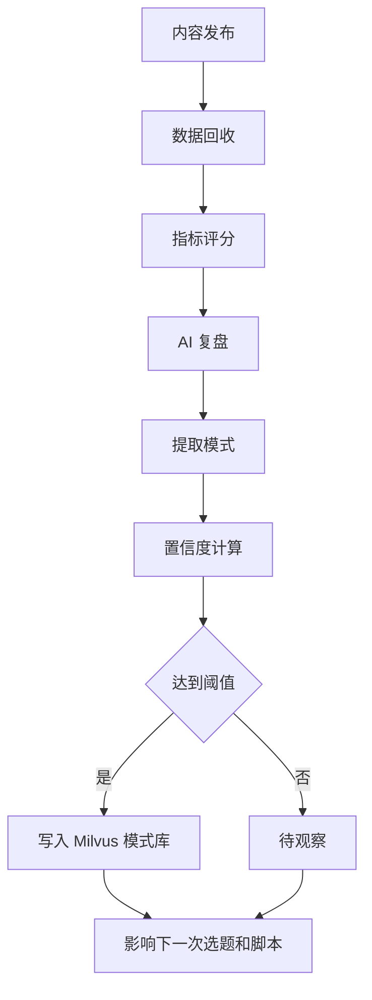

## 9. LangGraph 架构设计

## 9.1 Agent 节点

| Agent | 输入 | 输出 |
| --- | --- | --- |
| Retrieval Agent | 用户意图、平台、账号 | 历史相似内容、成功/失败案例 |
| Data Analyst Agent | 内容指标、粉丝画像 | 数据洞察、异常点、评分 |
| Topic Agent | 用户方向、历史案例 | 候选选题 |
| SEO Agent | 选题、关键词、平台 | 标题、简介、标签、SEO 建议 |
| Script Agent | 选题、风格、历史脚本 | 口播脚本 |
| Persona Agent | 账号定位、人设、禁用词 | 风格约束和风险提醒 |
| Review Agent | 生成结果 | 质量检查、平台适配检查 |
| Memory Agent | 发布结果、复盘报告 | 可沉淀记忆 |

## 9.2 选题 Graph

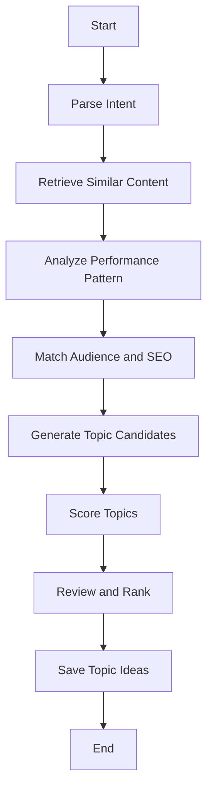

## 9.3 脚本 Graph

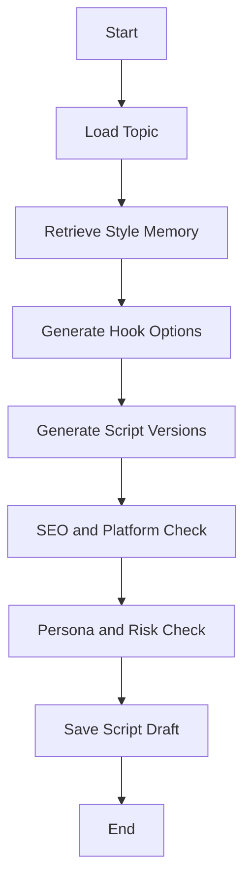

## 9.4 复盘 Graph

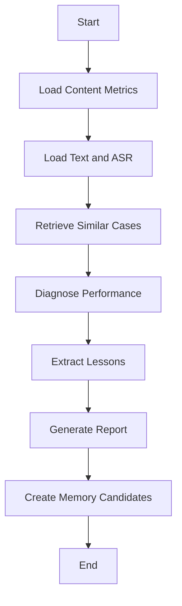

## 10. 采集端架构

## 10.1 Electron 采集端

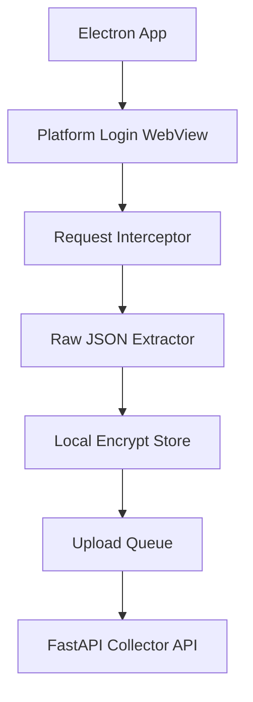

模块：

- 登录态模块。
- 平台适配器模块。
- 请求拦截模块。
- 数据解析模块。
- 本地加密存储模块。
- 上传队列模块。
- 采集日志模块。

## 10.2 浏览器插件

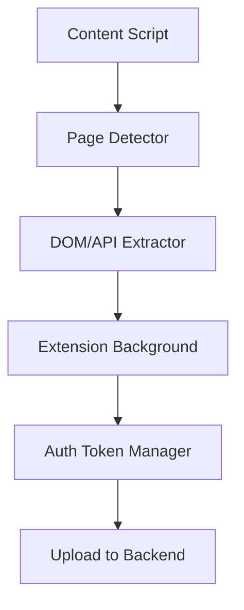

模块：

- Content Script。
- Background Service Worker。
- Popup UI。
- Side Panel。
- 页面识别器。
- 数据抽取器。
- 后端上传器。

## 10.3 Connector 插件接口

每个平台实现统一接口：

```python
class PlatformConnector:
    platform: str

    async def detect_page(self, context) -> bool:
        ...

    async def collect_account_profile(self, context) -> dict:
        ...

    async def collect_content_list(self, context, cursor: str | None = None) -> dict:
        ...

    async def collect_content_detail(self, context, content_id: str) -> dict:
        ...

    async def collect_metrics(self, context, content_id: str) -> dict:
        ...

    async def collect_comments(self, context, content_id: str) -> dict:
        ...
```

## 11. API 架构

## 11.1 API 分组

```text
/api/v1/auth
/api/v1/workspaces
/api/v1/platform-accounts
/api/v1/contents
/api/v1/analytics
/api/v1/ai
/api/v1/memory
/api/v1/collector
/api/v1/workflows
/api/v1/reports
```

## 11.2 长任务模式

AI 生成、ETL、向量化、复盘都使用异步任务：

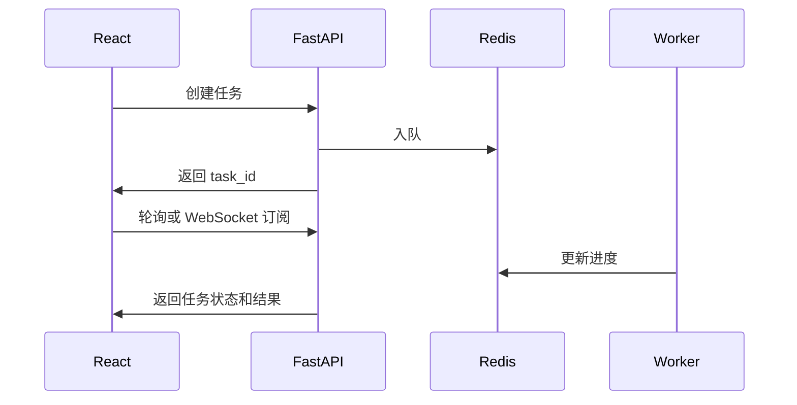

任务状态：

- `pending`
- `running`
- `succeeded`
- `failed`
- `cancelled`

## 12. 部署架构

## 12.1 本地开发

```text
Docker Compose
  fastapi
  worker
  postgres
  mongodb
  redis
  milvus
  minio
  frontend
```

## 12.2 生产部署

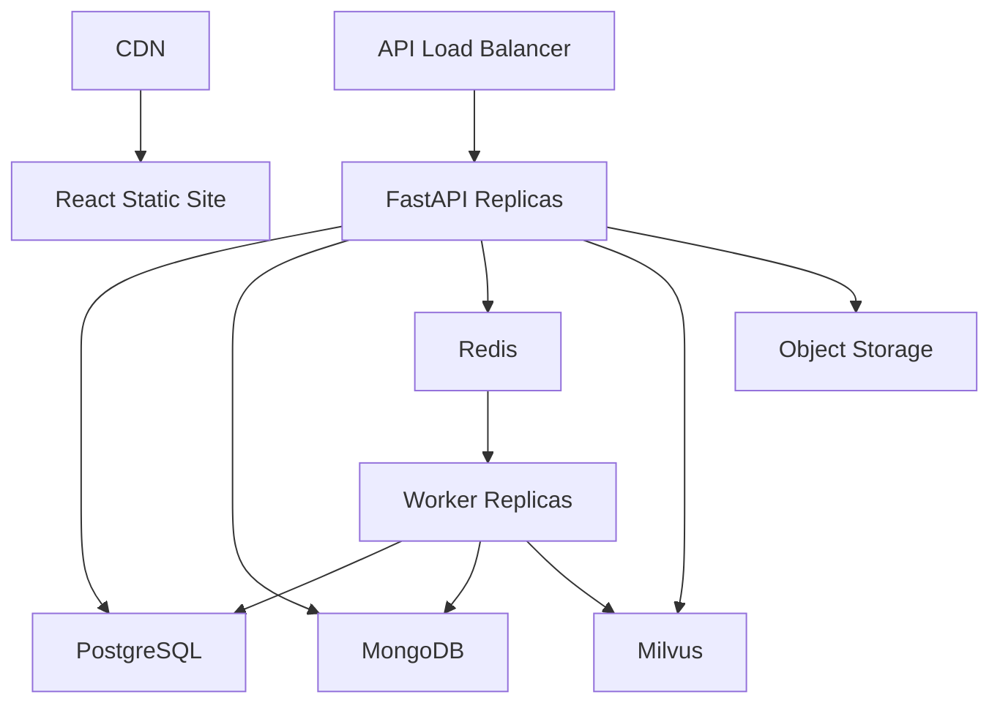

推荐：

- 前期 Docker Compose + 单机部署。
- 中期使用 Kubernetes 或云服务容器平台。
- PostgreSQL、MongoDB、Redis、Milvus 优先使用托管服务或独立实例。
- Worker 可水平扩展。
- AI 调用做限流和成本监控。

## 13. 可观测性设计

日志：

- API 请求日志。
- 采集日志。
- ETL 日志。
- Agent 执行日志。
- LLM 调用日志。
- 向量入库日志。

指标：

- API 延迟。
- 任务队列长度。
- Worker 成功率。
- LLM token 成本。
- Milvus 检索延迟。
- ETL 处理速度。
- 采集失败率。

追踪：

- 每次采集生成 `trace_id`。
- 每次 AI 生成生成 `generation_id`。
- 每次 Agent 工作流记录节点输入、输出和耗时。
- 每条标准数据可追溯到 Raw 文档。

## 14. 安全架构

### 14.1 鉴权

- JWT 或 server-side session。
- Workspace 级权限。
- 平台账号级权限。
- API key 用于采集端。

### 14.2 数据安全

- 平台 Cookie 本地加密。
- 敏感配置使用环境变量或 Secret Manager。
- 数据库最小权限。
- Raw 数据访问需要权限校验。
- AI 日志可脱敏。

### 14.3 合规控制

- 采集频率限制。
- 用户授权确认。
- 支持删除平台账号数据。
- 支持导出数据。
- 保留采集来源和任务日志。

## 15. 扩展点设计

### 15.1 平台扩展

新增平台时需要实现：

- Raw collection。
- Connector。
- ETL mapper。
- 指标映射。
- 平台 SEO 规则。
- 平台内容改写模板。

### 15.2 模型扩展

支持替换：

- Chat model。
- Embedding model。
- Reranker。
- 本地模型。
- 云模型。

### 15.3 Agent 扩展

新增 Agent 时需要定义：

- 输入 schema。
- 输出 schema。
- 使用工具。
- 记忆检索策略。
- 失败回退策略。
- 结果保存策略。

## 16. MVP 技术落地顺序

建议按以下顺序开发：

1. FastAPI 项目骨架。
2. PostgreSQL schema 和 Alembic。
3. MongoDB 抖音数据读取。
4. 抖音 ETL：视频、指标、ASR、粉丝。
5. React 工作台骨架。
6. 视频库和视频详情。
7. Milvus collection 初始化。
8. 历史内容向量化。
9. 相似内容检索 API。
10. LangGraph 选题生成。
11. 脚本、标题、标签生成。
12. 单条视频复盘。
13. 用户反馈记录。
14. 记忆沉淀和模式库。
15. Electron/插件采集端。

## 17. 关键技术决策

| 决策 | 选择 | 原因 |
| --- | --- | --- |
| 后端框架 | FastAPI | Python AI 生态成熟，异步 API 友好 |
| 工作流 | LangGraph | 适合多 Agent 状态编排 |
| 原始数据 | MongoDB | 保留平台 JSON 灵活性 |
| 标准数据 | PostgreSQL | 强关系、报表、权限和事务 |
| 向量库 | Milvus | 支持大规模向量检索和标量过滤 |
| 缓存队列 | Redis | 简单可靠，适合任务状态和缓存 |
| Web 前端 | React | 工作台复杂交互生态成熟 |
| 采集端 | Electron + 浏览器插件 | 覆盖后台长任务和页面即时采集 |
| 初期架构 | 模块化单体 | 降低 MVP 复杂度 |

## 18. 需要优先验证的技术风险

| 风险 | 验证方式 |
| --- | --- |
| 抖音 Raw 数据是否能稳定映射标准模型 | 先做 100 条视频 ETL 验证 |
| Milvus 检索结果是否真的帮助生成 | 用历史爆款/低效视频做召回测试 |
| 选题预测是否可信 | 与历史分位数和人工判断对照 |
| Agent 成本是否可控 | 记录 token、耗时、缓存命中 |
| 采集端是否稳定 | 先做抖音创作者后台单平台采集 |
| 多平台字段差异是否过大 | 每个平台先定义最小统一指标 |

## 19. 架构原则

- Raw 数据不可丢，标准数据可重建。
- 平台适配器插件化。
- AI 生成必须可追溯依据。
- Milvus 记忆必须可见、可审核、可删除。
- 长任务全部异步化。
- 先跑通抖音闭环，再扩多平台。
- 先模块化单体，再按压力拆服务。
- 用户反馈是系统进化的第一等数据。

