# AI 自媒体工作台交互流程设计

版本：v0.1  
日期：2026-05-09  
目标：定义核心任务流、AI 生成流、数据采集流和系统学习闭环。

## 1. 交互总原则

- 用户每次操作都应能看到系统状态。
- AI 长任务必须异步执行，并允许用户离开当前页面。
- 所有 AI 生成结果必须可保存、复制、改写、标记反馈。
- 涉及学习记忆的操作必须可审核。
- 涉及删除、覆盖、发布、采集凭证的操作必须确认。
- 复杂流程优先用右侧 Drawer 或分步面板，避免频繁跳转。

## 2. 全局交互模式

## 2.1 任务状态中心

所有长任务进入全局 Task Center：

- 数据导入。
- 采集同步。
- 向量化。
- AI 选题生成。
- AI 脚本生成。
- AI 复盘。
- 周报生成。

任务状态：

| 状态 | 用户可见文案 | 可操作 |
| --- | --- | --- |
| `pending` | 等待开始 | 取消 |
| `running` | 正在处理 | 后台运行、取消 |
| `requires_action` | 需要确认 | 查看并处理 |
| `succeeded` | 已完成 | 查看结果 |
| `failed` | 失败 | 重试、查看日志 |
| `cancelled` | 已取消 | 重新开始 |

## 2.2 AI 结果反馈

每个 AI 输出都提供：

- 采纳。
- 复制。
- 保存。
- 改写。
- 查看依据。
- 标记有用。
- 标记无用。
- 添加备注。

反馈进入 `ai_feedback`，后续用于记忆权重更新。

## 2.3 依据展示

AI 依据统一用 Evidence Drawer：

- 历史内容。
- 指标。
- 搜索关键词。
- 受众画像。
- 记忆模式。
- 用户配置。

每条依据可点击进入来源详情。

## 3. 首次使用与历史数据导入

### 用户目标

把已有 MongoDB 抖音历史数据接入工作台，生成初始看板和记忆库。

### 流程

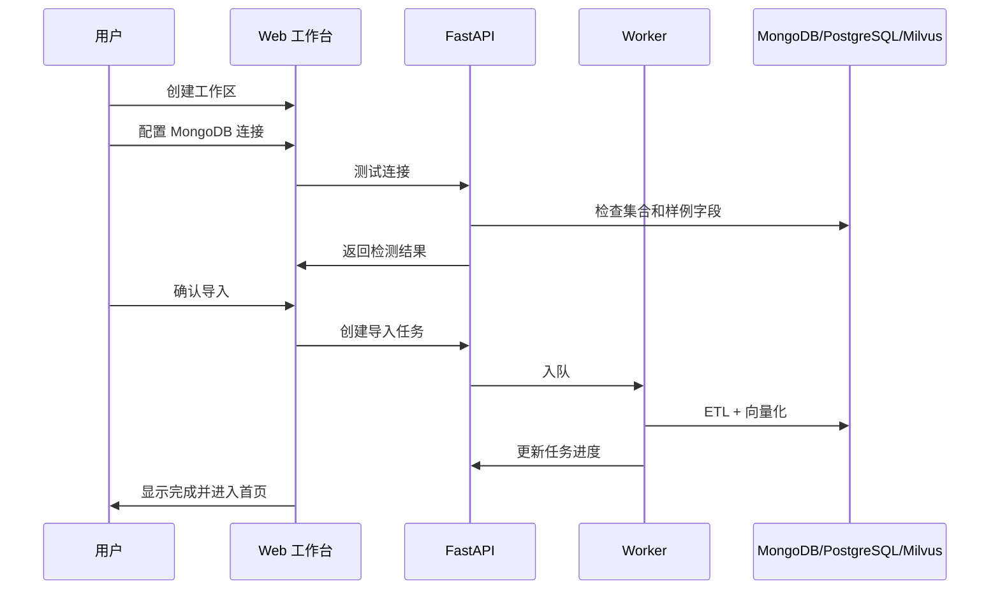

### 页面交互

1. 用户进入设置向导。
2. 输入 MongoDB 连接信息。
3. 点击“测试连接”。
4. 系统展示检测到的集合：
   - `douyin_video_raw`
   - `douyin_video_asr_results`
   - `douyin_fans_summary`
5. 用户确认导入。
6. 系统显示进度：
   - 读取 Raw 数据。
   - 标准化视频。
   - 关联 ASR。
   - 计算指标。
   - 写入 Milvus。
   - 生成初始洞察。
7. 完成后跳转首页。

### 异常处理

| 异常 | 处理 |
| --- | --- |
| MongoDB 连接失败 | 展示错误和重试按钮 |
| 缺少集合 | 允许跳过缺失集合 |
| 字段映射失败 | 生成待处理报告 |
| Milvus 写入失败 | 允许先完成标准数据导入，稍后补向量化 |

## 4. 视频详情到复盘流程

### 用户目标

分析一条视频为什么表现好或差。

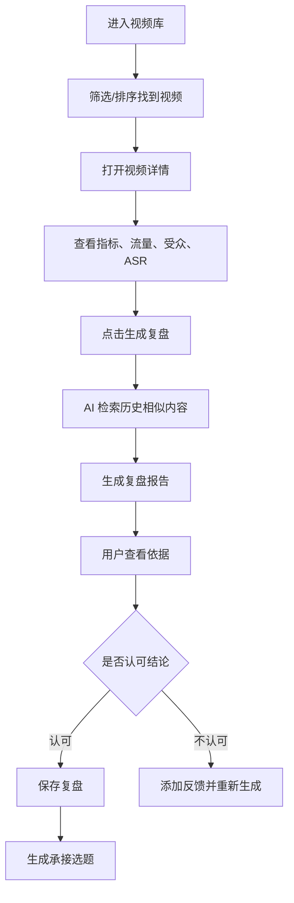

### 关键交互

- 视频详情 Header 固定展示“生成复盘”按钮。
- 复盘生成时右侧面板展示步骤。
- 生成完成后默认打开复盘摘要。
- 用户可展开依据。
- 用户可一键生成下一条承接选题。

## 5. 选题生成流程

### 用户目标

从一个方向生成多个有数据依据的选题。

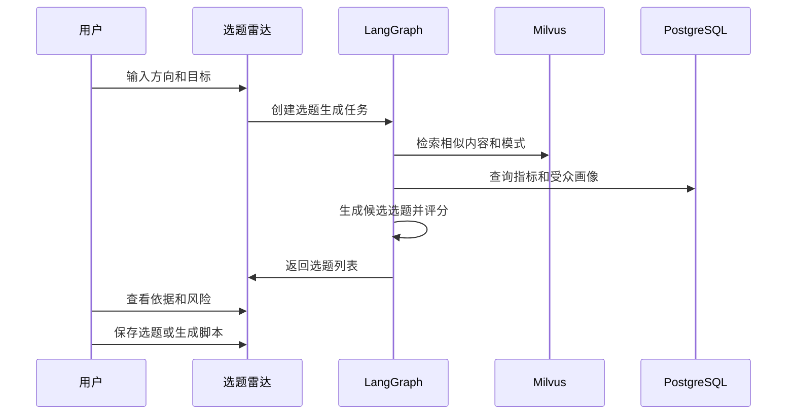

### 输入项

- 方向描述。
- 目标平台。
- 内容目标。
- 目标时长。
- 语气。
- 是否偏热点。
- 是否偏搜索。
- 是否生成系列。

### 输出项

- 选题名称。
- 推荐角度。
- 预测分。
- SEO 分。
- 受众匹配分。
- 难度分。
- 推荐理由。
- 风险。
- 相似历史视频。

### 交互状态

| 状态 | UI |
| --- | --- |
| 未输入 | 展示输入面板和历史方向建议 |
| 生成中 | 显示“检索历史内容 -> 分析指标 -> 生成候选 -> 评分” |
| 有结果 | 选题卡片列表 + 右侧详情 |
| 无结果 | 提示扩大方向或降低约束 |
| 失败 | 重试，并保留用户输入 |

## 6. 选题到脚本流程

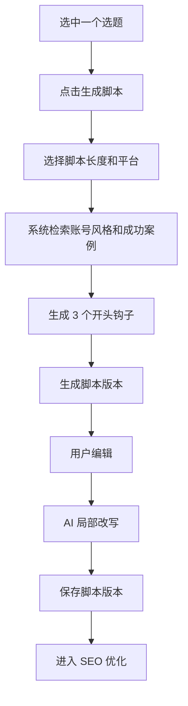

### 脚本编辑交互

- 左侧显示选题和历史依据。
- 中间编辑脚本。
- 右侧显示 AI 操作：
  - 改写开头。
  - 增强冲突。
  - 缩短到 30 秒。
  - 扩展到 90 秒。
  - 转小红书口吻。
  - 转 YouTube Shorts 英文版。

### 版本管理

每次生成或保存形成版本：

- `v1 AI 初稿`
- `v2 用户修改`
- `v3 抖音版`
- `v4 小红书版`

用户可对比版本差异。

## 7. SEO 优化流程

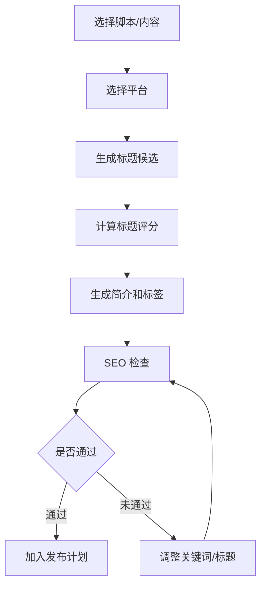

### 标题实验

标题候选展示：

- 标题文本。
- 预计点击吸引力。
- 搜索覆盖。
- 风险。
- 相似历史标题表现。

用户可以：

- 设为主标题。
- 保存为备选。
- 改写。
- 加入 A/B 实验。

## 8. 多平台改写流程

### 用户目标

将一条内容适配为多个平台版本。

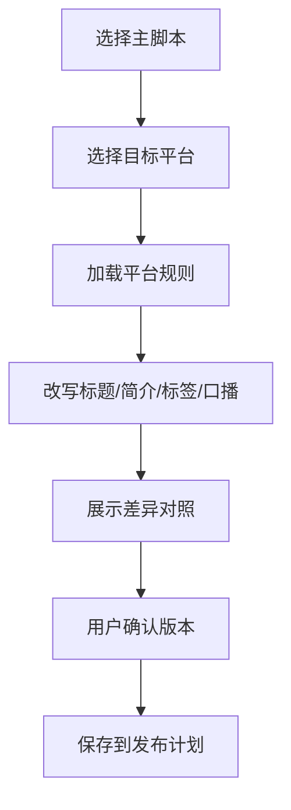

### 差异对照

| 内容 | 展示 |
| --- | --- |
| 原版 | 左侧 |
| 平台版 | 右侧 |
| 改写原因 | 下方 |
| 风险提示 | 右侧提示 |

## 9. 记忆沉淀流程

### 用户目标

控制系统学到什么，避免错误学习。

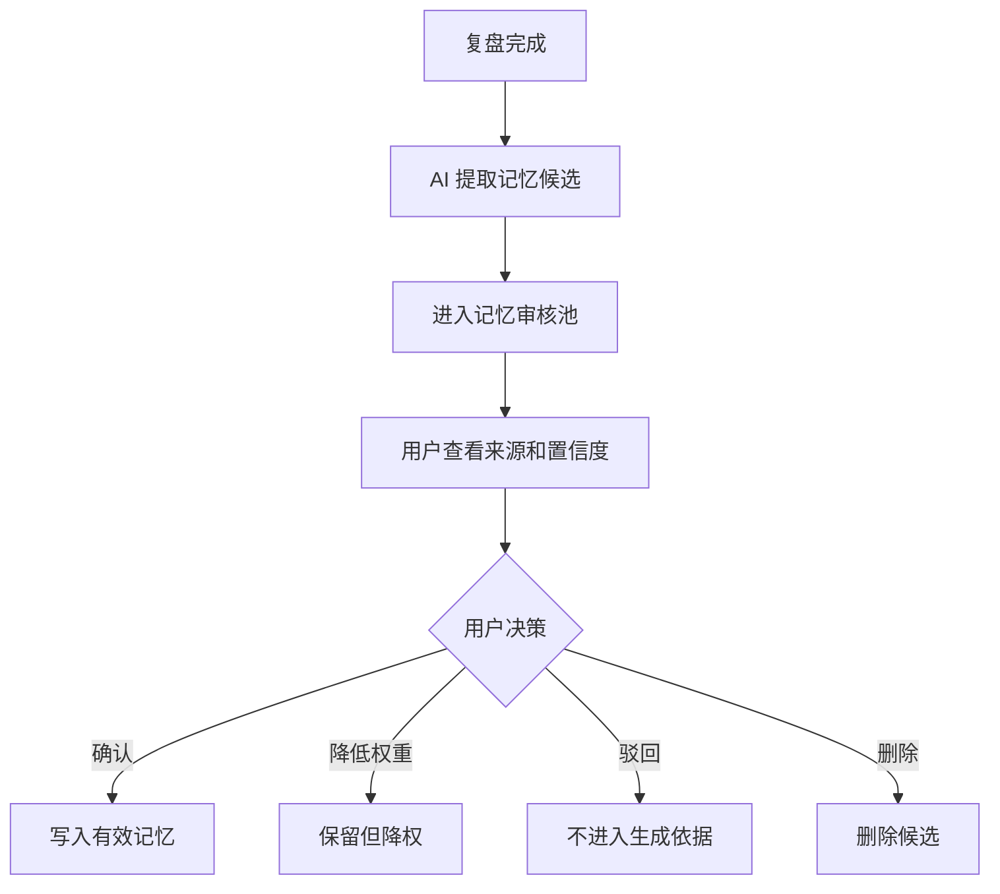

### 记忆候选展示

- 模式标题。
- 模式类型。
- 置信度。
- 支撑样本数。
- 来源视频。
- 正向/反向指标。
- 适用平台。
- 过期风险。

## 10. 采集任务流程

## 10.1 Electron 采集

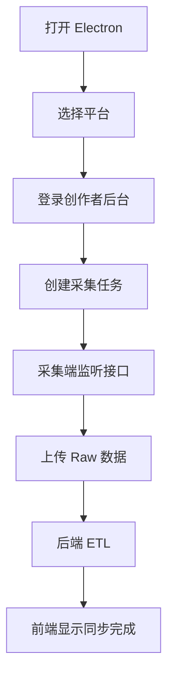

### 用户交互

- 采集端显示当前登录平台。
- 显示采集任务列表。
- 每个任务显示进度、数量、错误。
- 失败任务可重试。
- 用户可暂停采集。

## 10.2 浏览器插件采集

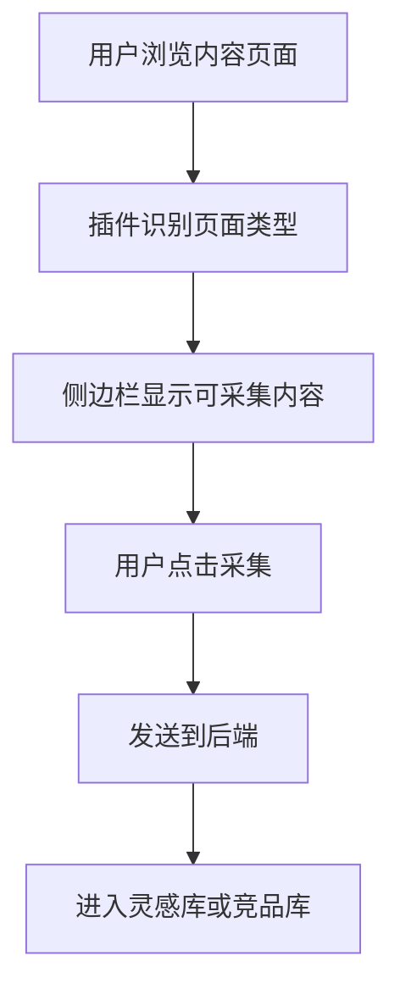

### 页面类型

- 单条视频。
- 账号主页。
- 搜索结果页。
- 评论区。
- 创作者后台数据页。

## 11. 发布计划流程

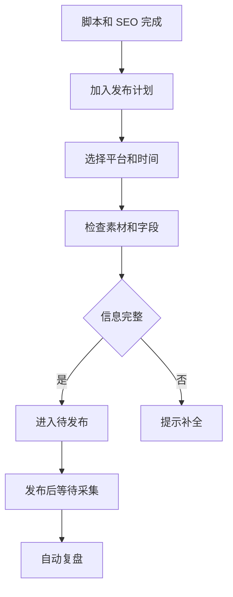

### 字段完整性检查

- 标题。
- 简介。
- 标签。
- 平台。
- 发布时间。
- 脚本。
- 封面文案。
- 素材链接。

## 12. 反馈学习闭环

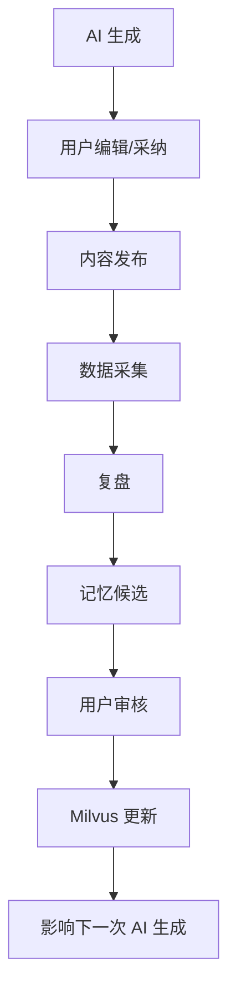

### 反馈类型

| 反馈 | 含义 |
| --- | --- |
| 采纳 | 用户认为结果可用 |
| 修改 | 用户基于结果继续编辑 |
| 废弃 | 用户不采用 |
| 有用 | 建议方向正确 |
| 无用 | 建议方向错误 |
| 表现好 | 发布后指标好 |
| 表现差 | 发布后指标差 |

## 13. 确认与撤销

需要确认的操作：

- 删除内容。
- 删除记忆。
- 覆盖脚本版本。
- 删除平台账号。
- 清空采集数据。
- 暂停所有采集任务。

应支持撤销的操作：

- 移动内容状态。
- 标记选题状态。
- 归档脚本。
- 驳回记忆候选。

## 14. 通知规则

通知类型：

- 采集完成。
- 采集失败。
- AI 生成完成。
- 复盘报告完成。
- 有记忆候选待审核。
- 指标异常。

通知原则：

- 任务完成通知可进入通知中心。
- 失败和需要用户处理的通知可以 Toast + 通知中心。
- 非关键成功状态不打扰用户。

