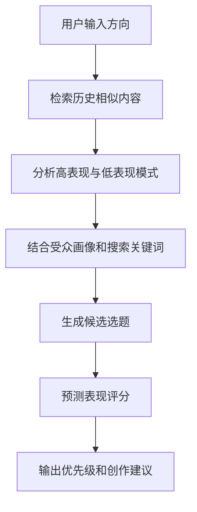
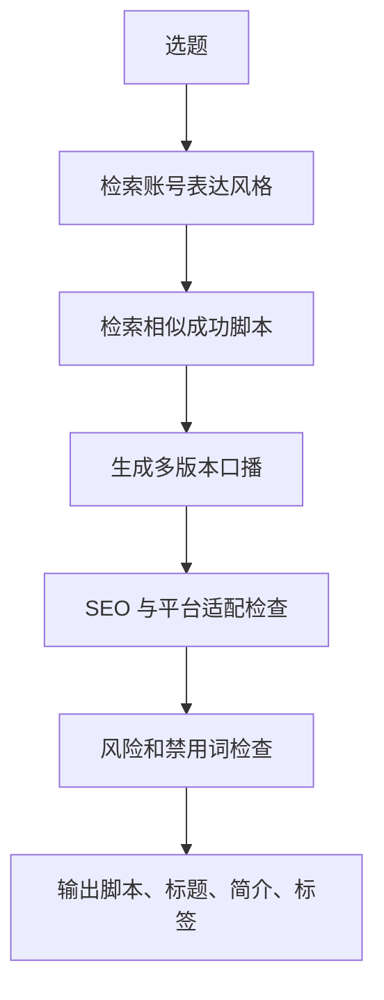
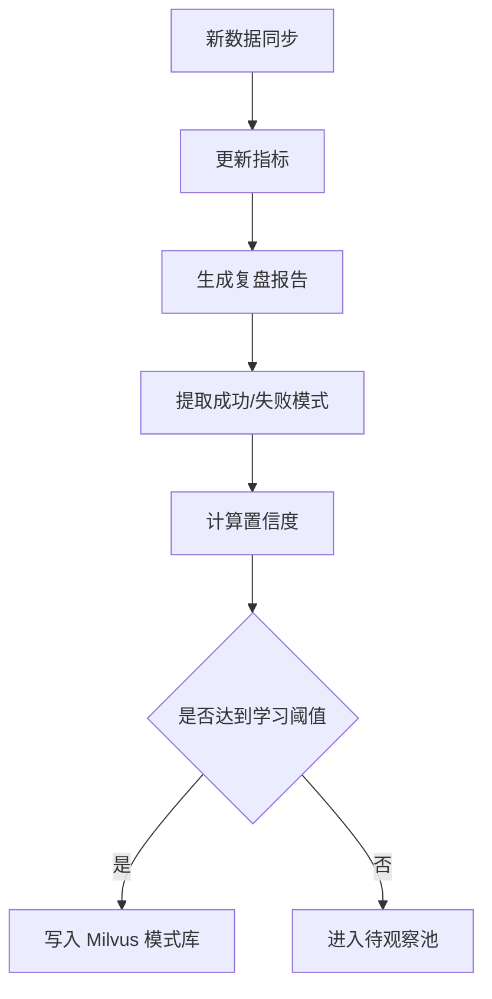
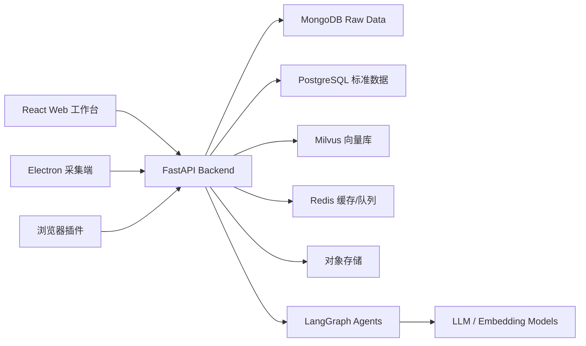

# AI 自媒体工作台软件需求文档

版本：v0.1  
日期：2026-05-09  
项目代号：VO Mate / AI Creator Workbench  
目标平台：抖音、快手、小红书、YouTube、微信视频号，后续扩展 B 站、TikTok、Instagram Reels 等。

## 1. 项目背景

创作者在多平台运营时会遇到几个长期问题：

- 历史数据分散在不同平台，难以统一比较。
- 内容创作依赖经验，选题、标题、口播、标签经常没有数据依据。
- 平台规则、受众偏好、SEO 关键词持续变化，人工复盘成本高。
- 采集数据、整理数据、写脚本、发布、复盘之间割裂。
- AI 工具多数只会“生成内容”，不会基于创作者自己的历史数据持续学习。

本项目希望建设一个面向自媒体创作者和团队的 AI 工作台：把多平台历史数据、实时采集、内容资产、受众画像、搜索关键词、向量记忆和 Agent 工作流统一起来，让系统能够预测选题潜力、生成口播内容、优化 SEO、制定发布策略，并通过 Milvus 向量库和反馈机制自动进化。

## 2. 产品定位

一句话定位：

用历史数据和 AI Agent 帮创作者发现更值得拍的选题，并把选题变成可发布、可复盘、可迭代的多平台内容资产。

核心差异：

- 不是通用 AI 写作工具，而是基于创作者私有历史数据的内容决策系统。
- 不是单平台数据看板，而是多平台统一数据中台。
- 不是一次性提示词生成，而是可记忆、可评估、可进化的内容运营系统。
- 不只生成标题和文案，还覆盖采集、分析、策划、生产、发布、复盘、学习闭环。

## 3. 建设目标

### 3.1 短期目标

- 接入已有 MongoDB 抖音历史数据。
- 建立视频、ASR、粉丝画像、互动指标的统一数据模型。
- 提供 AI 选题预测、口播脚本生成、标题/简介/标签生成。
- 建立 Milvus 向量知识库，支持历史内容召回和相似案例分析。
- 搭建 React Web 工作台，形成从数据看板到内容策划的核心闭环。

### 3.2 中期目标

- 支持快手、小红书、YouTube、视频号的数据采集和统一分析。
- 建立可配置的多平台 SEO 规则、标题规则、标签规则。
- 通过 LangGraph 编排多 Agent 内容生产流程。
- 支持内容实验、发布日历、复盘报告和策略迭代。
- Electron 采集端和浏览器插件形成稳定采集能力。

### 3.3 长期目标

- 形成创作者私有的内容大脑。
- 系统能从历史成功/失败案例中总结模式，并影响后续创作建议。
- 支持多账号、多团队、多行业模板。
- 支持从选题到视频成片的半自动生产链路。
- 构建跨平台内容 ROI 预测和自动化运营策略。

## 4. 用户角色

| 角色 | 目标 | 典型行为 |
| --- | --- | --- |
| 个人创作者 | 提升选题命中率和内容效率 | 看数据、找选题、生成口播、优化标题、复盘表现 |
| 内容运营 | 管理内容排期和多平台分发 | 制定计划、分派任务、跟踪指标、复盘团队产出 |
| 编导/文案 | 把选题变成脚本 | 查看历史爆款、生成结构、改写语气、做多版本测试 |
| 数据分析师 | 建模和策略分析 | 维护指标体系、看趋势、验证假设、输出报告 |
| 管理员 | 管理账号、权限、采集配置 | 配置平台账号、成员权限、数据源和模型参数 |

## 5. 核心用户场景

### 5.1 从历史数据找下一个选题

用户进入「选题雷达」，系统读取历史视频表现、ASR 口播文本、标题、标签、受众画像、搜索关键词和评论热词，输出：

- 值得继续做的主题簇。
- 表现下降但仍有搜索价值的旧选题。
- 可复用的爆款开头、结构和标题模式。
- 不建议继续投入的低效选题。
- 每个选题的预测播放、互动、完播、涨粉潜力评分。

### 5.2 从一个想法生成可拍脚本

用户输入一句想法，例如“程序员 35 岁危机”。系统输出：

- 选题定位。
- 目标人群。
- 口播角度。
- 3-5 个标题候选。
- 30 秒、60 秒、90 秒脚本版本。
- 开头 3 秒钩子。
- 评论区引导语。
- 平台差异化改写建议。
- 推荐标签、关键词和简介。
- 与历史相似内容的表现对照。

### 5.3 复盘一条视频为什么表现好或差

系统自动对单条视频做诊断：

- 流量来源结构是否健康。
- 搜索关键词是否命中标题/口播/标签。
- 完播率、5 秒留存、平均观看时长是否匹配视频长度。
- 点赞、评论、收藏、分享、关注转化是否异常。
- 受众画像是否偏离目标人群。
- 口播结构中哪个片段可能导致流失。
- 下一条内容应如何承接。

### 5.4 多平台改写和分发

用户准备一条视频内容，系统根据平台特性输出：

- 抖音版：强钩子、短标题、话题标签、评论引导。
- 快手版：更生活化、更强关系感的口吻。
- 小红书版：搜索友好标题、封面文案、笔记简介、关键词布局。
- YouTube Shorts 版：英文/双语标题、描述、hashtags。
- 视频号版：更适合私域转发和社交关系链的表达。

### 5.5 形成持续学习闭环

内容发布后，采集端定期同步数据。系统根据真实表现更新：

- 选题评分模型。
- 标题模式库。
- 高转化口播结构库。
- 低效内容反例库。
- 账号受众画像。
- 平台 SEO 关键词库。
- Milvus 中的向量记忆和经验总结。

## 6. 必要功能总览

### 6.1 MVP 必须具备

- 抖音历史数据接入。
- 视频列表、详情、核心指标看板。
- ASR 文本关联和口播分析。
- 粉丝画像和账号趋势分析。
- Milvus 向量入库与相似内容检索。
- AI 选题生成和选题评分。
- AI 口播脚本生成。
- AI 标题、简介、标签生成。
- 单条视频复盘报告。
- 内容工作台：选题、脚本、素材、发布计划。
- 用户登录、账号管理、基础权限。

### 6.2 第二阶段必须具备

- 快手、小红书、YouTube、视频号数据接入。
- Electron 采集端。
- 浏览器插件采集端。
- 多平台内容改写。
- 发布日历。
- 内容实验和 A/B 版本管理。
- 自动复盘周报/月报。
- Agent 工作流可视化和任务队列。

### 6.3 长期增强功能

- 趋势热点监控。
- 竞品账号追踪。
- 评论情绪和需求挖掘。
- 视频脚本转分镜。
- 素材库、B-roll 建议、封面文案生成。
- 自动生成字幕、SRT、VTT。
- 半自动发布。
- 团队协作、审核流和任务分配。
- 多模型路由和私有模型微调。

## 7. 功能需求

## 7.1 工作区与账号体系

### 功能说明

系统以 workspace 为核心组织数据。一个 workspace 可以绑定多个平台账号、多个成员和多个内容项目。

### 功能点

- 创建 workspace。
- 添加成员。
- 绑定平台账号。
- 配置账号行业、定位、目标人群、内容风格。
- 配置 AI 默认语气、禁用词、品牌词、常用 CTA。
- 配置数据采集频率。
- 配置 Milvus 知识库策略。

### 数据对象

- `workspace`
- `member`
- `platform_account`
- `brand_profile`
- `audience_profile`
- `ai_style_profile`

## 7.2 多平台数据采集

### 采集来源

- 平台开放 API。
- 创作者后台页面。
- Electron 桌面端。
- 浏览器插件。
- 用户手动导入 CSV/Excel。
- Webhook 或定时任务。

### 平台范围

| 平台 | 数据类型 | 采集方式 |
| --- | --- | --- |
| 抖音 | 视频、播放、互动、粉丝、搜索词、受众画像、评论热词、ASR | 已有 MongoDB 数据 + Electron/插件 |
| 快手 | 视频、互动、粉丝、流量来源 | Electron/插件/API 优先 |
| 小红书 | 笔记、视频、搜索词、收藏、评论、标签 | 插件/手动导入/API |
| YouTube | 视频、Shorts、观看、留存、搜索词、订阅转化 | YouTube Data API / Analytics API |
| 视频号 | 视频、互动、私域传播、粉丝 | 插件/Electron/手动导入 |

### 采集端能力

- 登录态检测。
- Cookie/session 本地加密存储。
- 页面接口监听。
- 数据结构自动识别。
- 采集任务队列。
- 失败重试。
- 增量同步。
- 采集日志。
- 手动触发同步。
- 敏感字段脱敏。

### 注意事项

- 对不同平台采集方式要保持插件化设计。
- 原始数据必须完整保留到 MongoDB。
- 标准化后的分析数据写入 PostgreSQL。
- 向量化内容进入 Milvus。
- 高频任务和缓存使用 Redis。

## 7.3 历史数据中台

### 目标

将各平台原始数据转为统一分析模型，让 AI 和看板可以跨平台使用。

### 数据层设计

| 层级 | 存储 | 说明 |
| --- | --- | --- |
| Raw 原始层 | MongoDB | 保存平台原始 JSON，不破坏字段 |
| Normalized 标准层 | PostgreSQL | 抽取统一视频、指标、账号、标签等结构 |
| Feature 特征层 | PostgreSQL / Redis | 供预测模型和 Agent 使用的聚合特征 |
| Vector 向量层 | Milvus | 标题、脚本、ASR、评论、标签、总结、策略等向量 |
| Cache 缓存层 | Redis | 会话、任务状态、热点查询、Agent 中间结果 |

### 当前抖音数据映射

已有 MongoDB 字段字典：

- `douyin_video_raw`：视频基础信息、公开统计、创作者后台指标、受众画像、流量来源、搜索关键词、评论热词。
- `douyin_video_asr_results`：视频 ASR 全文、字幕 segments、语言、时长。
- `douyin_fans_summary`：账号粉丝总数、涨粉掉粉、粉丝画像、兴趣分布、榜单用户。

标准化后建议形成以下核心表：

- `content_items`
- `content_metrics_daily`
- `content_lifetime_metrics`
- `content_text_assets`
- `content_tags`
- `content_search_keywords`
- `content_traffic_sources`
- `content_audience_profiles`
- `account_fans_snapshots`
- `account_fans_trends`
- `account_audience_profiles`

## 7.4 数据看板

### 首页总览

- 总播放量。
- 总互动量。
- 总粉丝数。
- 近 7 日/30 日涨粉。
- 播放最高视频。
- 涨粉最高视频。
- 完播率最高视频。
- 搜索流量最高视频。
- 最近异常波动。
- AI 推荐今日行动。

### 视频分析看板

- 视频列表。
- 多条件筛选：平台、账号、发布时间、选题、标签、播放区间、完播率区间。
- 指标排序：播放、点赞、评论、收藏、分享、完播、5 秒留存、涨粉。
- 视频详情页。
- 视频表现雷达图。
- 流量来源图。
- 搜索关键词图。
- 受众画像图。
- ASR 口播结构分析。
- 评论热词。
- AI 复盘结论。

### 粉丝分析看板

- 粉丝总数趋势。
- 净增/取关趋势。
- 粉丝来源。
- 性别、年龄、地域、设备、兴趣。
- 粉丝活跃时间。
- 高互动粉丝榜。
- 粉丝兴趣变化。
- AI 人群洞察。

## 7.5 AI 选题雷达

### 功能目标

让用户知道“接下来应该拍什么”，并知道为什么。

### 输入

- 历史视频标题。
- ASR 口播文本。
- 标签。
- 搜索关键词。
- 评论热词。
- 视频表现指标。
- 受众画像。
- 粉丝兴趣。
- 用户输入的方向。
- 外部热点或竞品数据。

### 输出

- 选题列表。
- 选题分类。
- 推荐理由。
- 预测指标。
- 风险提示。
- 相似历史视频。
- 推荐标题。
- 推荐口播角度。
- 推荐标签。
- 适合平台。
- 内容生产优先级。

### 评分维度

| 维度 | 说明 |
| --- | --- |
| 历史表现 | 同类内容过去播放、互动、完播、涨粉表现 |
| 受众匹配 | 是否匹配当前账号核心受众 |
| 搜索潜力 | 关键词是否有搜索和 SEO 价值 |
| 内容延展 | 是否能拆成系列 |
| 创作者优势 | 是否符合账号历史擅长表达 |
| 平台适配 | 是否适合目标平台 |
| 竞争风险 | 是否过度拥挤或同质化 |
| 转化价值 | 是否能带来关注、私域、咨询或商业目标 |

## 7.6 AI 口播脚本生成

### 脚本类型

- 30 秒短口播。
- 60 秒标准口播。
- 90 秒深度口播。
- 系列视频脚本。
- 直播切片脚本。
- 小红书笔记口吻改写。
- YouTube Shorts 英文/双语版本。

### 脚本结构

- 开头钩子。
- 痛点共鸣。
- 观点表达。
- 案例/经历。
- 反转或冲突。
- 方法论。
- 总结。
- 评论引导。
- 关注引导。

### AI 能力

- 根据历史高表现脚本学习用户表达风格。
- 根据低表现视频避免类似结构。
- 根据平台生成不同节奏。
- 自动控制字数和时长。
- 生成多版本。
- 标注每一句的作用。
- 提供可拍摄提示。
- 生成字幕分段。

## 7.7 SEO、标题、简介和标签

### 平台差异

| 平台 | 优化重点 |
| --- | --- |
| 抖音 | 前 3 秒钩子、标题情绪、话题标签、评论互动 |
| 快手 | 真实感、关系感、生活化表达、垂类标签 |
| 小红书 | 搜索关键词、标题结构、封面关键词、笔记信息密度 |
| YouTube | 标题 CTR、描述关键词、hashtags、章节、搜索意图 |
| 视频号 | 社交转发、信任表达、私域承接、公众号联动 |

### 功能点

- 标题生成。
- 标题评分。
- 标题相似历史案例对照。
- 标题 SEO 关键词覆盖检查。
- 简介生成。
- 标签推荐。
- 禁用词检查。
- 平台长度限制检查。
- 多语言标题。
- A/B 标题实验。

## 7.8 单条视频 AI 复盘

### 输入

- 视频元数据。
- 播放和互动指标。
- 创作者后台深度指标。
- 流量来源。
- 搜索关键词。
- 受众画像。
- ASR 文本。
- 评论热词。
- 发布时段。

### 输出

- 一句话结论。
- 表现等级。
- 最大优势。
- 最大问题。
- 指标异常点。
- 口播结构分析。
- 标题和搜索匹配分析。
- 受众匹配分析。
- 下一条视频建议。
- 是否应做系列。
- 是否应改标题/封面/简介。

## 7.9 内容工作流

### 内容状态

- 灵感。
- 候选选题。
- 已评分。
- 已生成脚本。
- 待拍摄。
- 待剪辑。
- 待发布。
- 已发布。
- 已复盘。
- 已沉淀为知识。

### 工作台视图

- 选题池。
- 脚本编辑器。
- 发布日历。
- 素材库。
- 复盘中心。
- 知识库。
- 实验中心。

### 协作功能

- 任务分配。
- 评论批注。
- 审核流。
- 版本历史。
- 修改建议。
- 权限控制。

## 7.10 Milvus 自动进化学习

### 设计目标

Milvus 不只是做相似搜索，而是作为创作者私有内容记忆库。系统需要把历史内容、表现结果、用户反馈、AI 总结和策略经验持续写入向量库，让后续生成更贴近账号真实能力。

### 向量记忆类型

| 记忆类型 | 内容 | 用途 |
| --- | --- | --- |
| content_memory | 标题、文案、ASR、简介、标签 | 找相似内容、学习表达风格 |
| performance_memory | 内容文本 + 指标摘要 | 判断什么内容表现好 |
| audience_memory | 受众画像、粉丝兴趣、评论热词 | 匹配目标人群 |
| seo_memory | 搜索关键词、排名词、平台标签 | SEO 和标题优化 |
| pattern_memory | AI 总结出的成功/失败模式 | 生成策略建议 |
| experiment_memory | A/B 测试版本和结果 | 预测不同版本潜力 |
| brand_memory | 账号定位、禁用词、表达风格 | 保持一致的人设 |

### Milvus collection 建议

| Collection | 主键 | 向量内容 | 重要标量字段 |
| --- | --- | --- | --- |
| `creator_content_vectors` | `vector_id` | 标题 + 文案 + ASR + 标签 | workspace_id, platform, account_id, content_id, publish_time, topic, metric_score |
| `creator_pattern_vectors` | `pattern_id` | 成功/失败模式总结 | pattern_type, confidence, source_count, last_verified_at |
| `creator_audience_vectors` | `audience_id` | 人群画像和兴趣总结 | account_id, platform, segment_type, tgi, period |
| `creator_seo_vectors` | `keyword_id` | 关键词、搜索意图、标题样例 | platform, keyword, search_score, conversion_score |
| `creator_experiment_vectors` | `experiment_id` | 实验假设、版本、结果 | experiment_type, winner, lift, status |

### 自动进化流程

1. 数据采集完成后写入 MongoDB。
2. ETL 抽取标准字段到 PostgreSQL。
3. 特征工程生成内容表现评分。
4. 文本切分：标题、简介、ASR、评论热词、关键词、AI 总结。
5. Embedding 生成向量。
6. 写入 Milvus。
7. LangGraph 运行复盘 Agent，总结成功/失败模式。
8. 新模式经过置信度计算后写入 `creator_pattern_vectors`。
9. 后续生成选题和脚本时，从 Milvus 检索相似成功案例、失败案例和人群偏好。
10. 用户采纳、修改、发布、实际表现再次回流，更新记忆权重。

### 记忆评分

建议为每条内容计算 `metric_score`：

```text
metric_score =
  w1 * 播放量分位数
+ w2 * 完播率分位数
+ w3 * 5秒留存分位数
+ w4 * 评论率分位数
+ w5 * 收藏率分位数
+ w6 * 分享率分位数
+ w7 * 涨粉转化分位数
- w8 * 负反馈分位数
```

不同账号和平台需要独立归一化，避免大账号数据压制小账号。

### 记忆更新策略

- 新内容入库：立即生成基础向量。
- 发布 24 小时：生成初步表现总结。
- 发布 7 天：生成稳定表现总结。
- 发布 30 天：写入长期模式库。
- 用户手动标记“好案例/坏案例”：提高权重。
- AI 判断过期模式：降低权重。
- 同质内容过多：聚类合并。
- 低置信度模式：先进入待审核池。

### 防止错误学习

- 不把单条偶然爆款直接当作规律。
- 至少 N 条相似内容验证后再形成模式。
- 区分平台、账号、时期、内容类型。
- 对异常流量、投流、热点事件做标记。
- 人工可查看和删除系统学习到的模式。

## 7.11 LangGraph Agent 工作流

### Agent 角色

| Agent | 职责 |
| --- | --- |
| Data Analyst Agent | 分析历史数据、发现异常、计算特征 |
| Topic Strategist Agent | 生成和筛选选题 |
| SEO Agent | 关键词、标题、简介、标签优化 |
| Script Writer Agent | 生成口播脚本 |
| Persona Agent | 保持账号人设、语气和禁用边界 |
| Review Agent | 检查逻辑、风险、平台适配 |
| Experiment Agent | 设计 A/B 测试和复盘 |
| Memory Curator Agent | 从结果中提炼可复用经验并写入 Milvus |

### 选题生成 Graph



### 脚本生成 Graph



### 复盘学习 Graph



## 8. 系统架构

## 8.1 总体架构



## 8.2 后端技术栈

- Python 3.11+
- FastAPI
- Pydantic
- SQLAlchemy / SQLModel
- Alembic
- Motor / PyMongo
- LangChain
- LangGraph
- Milvus SDK
- Redis
- Celery / RQ / Dramatiq
- PostgreSQL
- MongoDB
- OpenTelemetry

## 8.3 前端技术栈

- React
- TypeScript
- Vite 或 Next.js
- TanStack Query
- Zustand 或 Redux Toolkit
- React Router
- ECharts / Recharts
- Tailwind CSS 或 Ant Design / shadcn/ui
- Monaco Editor 用于脚本编辑

## 8.4 Electron 采集端

### 功能

- 平台登录态管理。
- 本地 Cookie 加密。
- 自动打开创作者后台。
- 定时采集。
- 网络请求监听。
- 页面 DOM 辅助解析。
- 本地采集日志。
- 失败重试。
- 采集结果上传 FastAPI。
- 本地任务状态展示。

### 适合采集

- 平台后台接口返回的 JSON。
- 需要登录态但没有开放 API 的数据。
- 大批量历史数据。
- 长时间后台同步任务。

## 8.5 浏览器插件

### 功能

- 当前页面数据识别。
- 一键采集当前视频/笔记/评论/搜索页。
- 内容灵感剪藏。
- 竞品账号收藏。
- 网页侧边栏 AI 分析。
- 将页面内容发送到工作台。
- 支持 Chrome/Edge。

### 适合采集

- 单条内容。
- 搜索结果页。
- 竞品内容。
- 小红书/视频号等页面型数据。
- 临时灵感。

## 9. 数据库设计建议

## 9.1 MongoDB

MongoDB 负责保存原始数据，原则是少改动、可追溯、可重放 ETL。

### 建议集合

- `douyin_video_raw`
- `douyin_video_asr_results`
- `douyin_fans_summary`
- `kuaishou_video_raw`
- `xiaohongshu_note_raw`
- `youtube_video_raw`
- `wechat_channels_video_raw`
- `collector_tasks`
- `collector_logs`
- `raw_import_batches`

## 9.2 PostgreSQL

PostgreSQL 负责标准化业务数据、权限和工作流。

### 核心表

```text
workspaces
users
workspace_members
platform_accounts
content_items
content_metrics_daily
content_lifetime_metrics
content_text_assets
content_tags
content_keywords
content_traffic_sources
content_audience_profiles
account_fans_snapshots
account_fans_trends
topic_ideas
script_drafts
script_draft_versions
publish_plans
experiments
ai_generations
ai_feedback
memory_events
```

### `content_items` 关键字段

- `id`
- `workspace_id`
- `platform`
- `account_id`
- `platform_content_id`
- `title`
- `description`
- `publish_time`
- `duration_seconds`
- `content_type`
- `cover_url`
- `video_url`
- `status`
- `topic_cluster_id`
- `created_at`
- `updated_at`

### `content_lifetime_metrics` 关键字段

- `content_id`
- `play_count`
- `like_count`
- `comment_count`
- `share_count`
- `collect_count`
- `follow_count`
- `profile_visit_count`
- `avg_view_duration`
- `avg_view_percent`
- `finish_rate`
- `five_second_retention`
- `bounce_rate`
- `negative_feedback_count`
- `metric_score`

### `topic_ideas` 关键字段

- `id`
- `workspace_id`
- `topic`
- `angle`
- `target_audience`
- `platforms`
- `prediction_score`
- `seo_score`
- `audience_fit_score`
- `difficulty_score`
- `reason`
- `status`
- `created_by`
- `created_at`

### `script_drafts` 关键字段

- `id`
- `workspace_id`
- `topic_idea_id`
- `title`
- `body`
- `platform`
- `status`
- `current_version_id`
- `adopted_version_id`
- `created_at`
- `updated_at`

### `script_draft_versions` 关键字段

- `id`
- `draft_id`
- `version_no`
- `label`
- `platform`
- `duration_seconds`
- `body`
- `description`
- `tags`
- `title_candidates`
- `source_type`
- `parent_version_id`
- `generation_id`
- `status`
- `created_at`

## 9.3 Redis

Redis 负责缓存和任务状态：

- 登录 session。
- API 缓存。
- Agent 临时状态。
- 采集任务队列。
- embedding 任务队列。
- 生成任务进度。
- WebSocket 消息。
- 限流计数。

## 9.4 Milvus

Milvus 负责向量检索和记忆演化：

- 使用 HNSW 或 IVF_FLAT 视数据量决定。
- 按 workspace/account/platform 做标量过滤。
- 记录 embedding model 版本。
- 保留文本 chunk 原文引用。
- 向量记录必须能追溯到 MongoDB 原始文档和 PostgreSQL 标准对象。

## 10. API 需求

## 10.1 账号与权限

- `POST /auth/login`
- `POST /auth/logout`
- `GET /me`
- `GET /workspaces`
- `POST /workspaces`
- `GET /platform-accounts`
- `POST /platform-accounts`

## 10.2 数据与看板

- `GET /contents`
- `GET /contents/{id}`
- `GET /contents/{id}/metrics`
- `GET /contents/{id}/analysis`
- `GET /contents/{id}/asr`
- `GET /accounts/{id}/fans-summary`
- `GET /dashboard/overview`
- `GET /dashboard/topics`

## 10.3 AI

- `POST /ai/topic-ideas`
- `POST /ai/topic-score`
- `POST /ai/script`
- `POST /ai/title`
- `POST /ai/seo`
- `POST /ai/review-content`
- `POST /ai/video-retrospective`
- `POST /ai/multi-platform-rewrite`

## 10.4 向量与记忆

- `POST /memory/index-content`
- `POST /memory/search`
- `GET /memory/patterns`
- `POST /memory/patterns`
- `PATCH /memory/patterns/{id}`
- `DELETE /memory/patterns/{id}`

## 10.5 采集

- `POST /collector/tasks`
- `GET /collector/tasks`
- `GET /collector/tasks/{id}`
- `POST /collector/upload`
- `GET /collector/logs`
- `POST /collector/import`

## 11. Web 端页面

## 11.1 信息架构

- 首页
- 数据看板
- 视频库
- 粉丝画像
- 选题雷达
- 脚本工作台
- SEO 优化
- 发布日历
- 复盘中心
- 知识库
- 采集管理
- 平台账号
- 设置

## 11.2 首页

首页不做营销页，直接进入工作台。

核心区域：

- 今日 AI 建议。
- 核心指标卡片。
- 近期表现趋势。
- 待处理内容。
- 推荐选题。
- 异常提醒。

## 11.3 选题雷达页面

- 输入方向。
- 选择平台。
- 选择内容目标：播放、涨粉、搜索、转化、互动。
- AI 生成选题。
- 选题评分表。
- 相似历史内容。
- 一键生成脚本。
- 加入选题池。

## 11.4 脚本工作台

- 左侧选题和历史案例。
- 中间脚本编辑器。
- 右侧 AI 建议。
- 标题候选。
- 标签候选。
- SEO 检查。
- 多平台版本。
- 保存版本。
- 标记采用/废弃。

## 11.5 复盘中心

- 自动复盘列表。
- 单条复盘详情。
- 周报/月报。
- 成功模式。
- 失败模式。
- 已写入 Milvus 的新经验。
- 用户确认/驳回。

## 12. AI 生成质量要求

### 12.1 内容必须可解释

每个 AI 建议都要说明依据：

- 来自哪些历史视频。
- 参考了哪些指标。
- 参考了哪些关键词。
- 目标人群是什么。
- 适合哪个平台。
- 风险在哪里。

### 12.2 内容必须可控

用户可以配置：

- 语气。
- 人设。
- 禁用词。
- 口播长度。
- 内容深度。
- 目标平台。
- 内容目标。
- 是否激进。
- 是否偏搜索。
- 是否偏情绪钩子。

### 12.3 内容必须可追踪

每一次 AI 生成需要记录：

- prompt。
- model。
- input references。
- output。
- user edits。
- final published version。
- performance result。
- feedback。

## 13. 预测模型需求

### 13.1 第一阶段

使用规则 + 统计分位数 + LLM 解释：

- 同类历史内容表现。
- 标题关键词匹配。
- ASR 语义相似度。
- 视频长度。
- 发布时间。
- 标签。
- 互动率。
- 完播率。
- 涨粉转化。

### 13.2 第二阶段

引入机器学习模型：

- 回归预测播放量分位数。
- 分类预测是否超过账号中位数。
- 排序模型用于选题优先级。
- 特征重要性解释。
- 按平台单独建模。

### 13.3 第三阶段

引入在线学习和实验反馈：

- A/B 标题效果。
- 不同脚本结构效果。
- 不同平台改写效果。
- 用户采纳率。
- 发布后真实表现。
- 自动更新选题评分权重。

## 14. 安全与合规

### 数据安全

- 用户密码加密存储。
- 平台 Cookie 本地加密。
- 敏感字段脱敏。
- 数据库访问最小权限。
- API 鉴权。
- 操作审计日志。
- 备份和恢复。

### 平台合规

- 明确区分官方 API、用户授权采集、页面辅助采集。
- 采集频率可控。
- 尊重平台限制。
- 不绕过付费墙或未授权访问。
- 用户可删除数据。
- 支持导出个人数据。

### AI 安全

- 禁止生成违法违规内容。
- 禁用词和风险词检测。
- 平台敏感话题提示。
- AI 建议必须允许人工审核。

## 15. 非功能需求

### 性能

- 视频列表查询 1 秒内返回。
- 单条视频分析 3 秒内返回已有结果。
- AI 生成任务允许异步，前端展示进度。
- 向量检索 1 秒内返回 TopK。
- 大批量采集和向量化走后台任务。

### 可扩展性

- 平台 connector 插件化。
- Agent workflow 可配置。
- Embedding model 可替换。
- LLM provider 可替换。
- 数据指标可扩展。

### 可观测性

- API 日志。
- 采集日志。
- Agent 执行轨迹。
- 向量入库日志。
- 任务耗时。
- 错误告警。
- 模型调用成本统计。

### 可维护性

- Raw 数据和标准数据分层。
- ETL 可重跑。
- Alembic 管理 PostgreSQL schema。
- 每个 AI 任务有版本号。
- 每个模式记忆有来源和置信度。

## 16. MVP 范围建议

### MVP 目标

先把抖音历史数据跑通，证明“历史数据 -> AI 选题/口播/复盘 -> 反馈学习”的闭环。

### MVP 功能清单

- 接入现有 MongoDB。
- 抽取抖音视频标准表。
- 抽取 ASR 文本。
- 抽取粉丝总览。
- 建立 React 工作台。
- 视频列表和详情。
- 核心指标看板。
- AI 选题生成。
- AI 脚本生成。
- AI 标题/标签/简介生成。
- Milvus 内容向量检索。
- 单条视频复盘。
- 用户反馈：采纳、修改、废弃、表现好、表现差。

### MVP 不做或延后

- 自动发布。
- 多团队复杂权限。
- 全平台同时接入。
- 复杂机器学习模型。
- 视频剪辑和素材生成。
- 完整竞品监控。

## 17. 里程碑

### M1：数据基础

- MongoDB 连接。
- 抖音 Raw 数据读取。
- PostgreSQL 标准表。
- ETL 初版。
- 基础 API。

### M2：看板和检索

- 视频库。
- 视频详情。
- 粉丝概览。
- ASR 展示。
- Milvus 向量入库。
- 相似视频检索。

### M3：AI 创作闭环

- 选题生成。
- 脚本生成。
- 标题/SEO/标签生成。
- 单条复盘。
- 用户反馈记录。

### M4：自动学习

- 表现评分。
- 成功/失败模式提取。
- Milvus pattern memory。
- 周报/月报。
- 记忆审核页面。

### M5：多平台扩展

- Electron 采集端。
- 浏览器插件。
- 快手/小红书/YouTube/视频号 connector。
- 多平台改写。

## 18. 验收标准

### 数据验收

- 能读取现有 `douyin_video_raw`、`douyin_video_asr_results`、`douyin_fans_summary`。
- 能将视频、指标、ASR、粉丝数据标准化。
- 能按 `video_id` 关联多集合数据。
- 能重跑 ETL。
- 能追溯到 MongoDB 原始文档。

### AI 验收

- 输入一个方向，能输出不少于 10 个选题。
- 每个选题有评分和推荐理由。
- 能生成至少 3 个标题版本。
- 能生成 30/60/90 秒口播脚本。
- 能解释参考了哪些历史内容。
- 能对单条视频生成复盘报告。
- 用户反馈能被记录并影响后续建议。

### Milvus 验收

- 历史视频文本可向量化入库。
- 可按 workspace、平台、账号过滤检索。
- 输入一个新选题能召回相似历史内容。
- 成功/失败模式可写入和查询。
- 每条向量可追溯来源。

### 产品验收

- 用户能从首页进入视频库。
- 用户能查看单条视频指标和 ASR。
- 用户能从视频详情生成复盘。
- 用户能从选题雷达生成脚本。
- 用户能保存脚本到内容工作台。
- 用户能查看 AI 建议的依据。

## 19. 风险与对策

| 风险 | 影响 | 对策 |
| --- | --- | --- |
| 平台接口变化 | 采集失败 | Connector 插件化、采集日志、快速适配 |
| 数据字段不统一 | 分析困难 | Raw 层保留、标准层 ETL、字段映射版本化 |
| AI 胡编建议 | 用户不信任 | 强制引用历史依据、生成可解释报告 |
| Milvus 学到错误模式 | 建议变差 | 置信度、人工审核、时间衰减、样本数门槛 |
| 多平台过早铺开 | 研发分散 | MVP 先做抖音闭环 |
| 数据量增长 | 查询变慢 | 分层存储、索引、异步任务、缓存 |
| 合规风险 | 账号或数据风险 | 用户授权、频率控制、敏感数据加密 |

## 20. 后续可拆分任务

### 后端任务

- 建立 FastAPI 项目结构。
- 配置 MongoDB/PostgreSQL/Redis/Milvus。
- 编写抖音 ETL。
- 编写内容指标计算。
- 编写 Milvus 入库服务。
- 编写 LangGraph 工作流。
- 编写 AI 生成 API。

### 前端任务

- 搭建 React 工作台。
- 建立布局和导航。
- 视频库页面。
- 视频详情页面。
- 选题雷达页面。
- 脚本编辑器页面。
- 复盘中心页面。
- 知识库页面。

### 采集端任务

- Electron 项目初始化。
- 登录态管理。
- 采集任务管理。
- 数据上传。
- 浏览器插件初始化。
- 页面数据识别。
- 一键采集。

### 数据任务

- 字段映射文档。
- PostgreSQL schema。
- 指标定义。
- 内容评分公式。
- 向量 collection schema。
- ETL 重跑机制。

## 21. 产品原则

- 先让系统懂你的历史，再让系统替你生成。
- 所有 AI 建议都要能追溯依据。
- 原始数据永远保留，标准数据可以重建。
- 先做抖音闭环，再扩展多平台。
- Milvus 记忆要可见、可控、可删除。
- 工作台第一屏必须可操作，不做空泛首页。
- AI 不是替代创作者，而是放大创作者的判断力。
