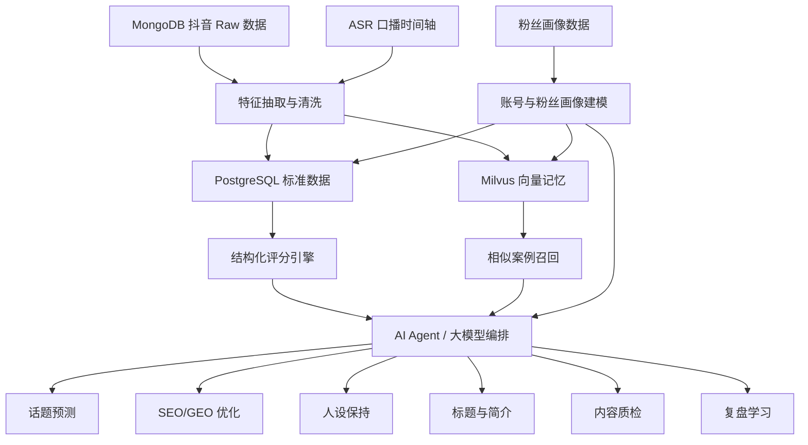

# 自媒体工作台需求分析

版本：v0.1  
日期：2026-05-11  
项目：VO Mate / AI Creator Workbench  
数据来源：抖音创作者平台历史数据、ASR 口播识别、粉丝画像与内容表现数据

## 1. 背景与目标

VO Mate 的核心目标不是做一个通用文案生成器，而是做一个面向自媒体创作者的私有内容工作台。系统需要把创作者历史内容、粉丝画像、搜索关键词、评论反馈、ASR 口播文本、内容表现指标和 AI 大模型结合起来，帮助创作者完成选题、标题、简介、口播、SEO/GEO 优化、人设保持和内容质检。

当前已有抖音创作者平台历史数据，包括：

- 作品原始数据：标题、简介、发布时间、时长、话题、封面、播放地址、作者信息。
- 创作者经营指标：播放、点赞、评论、收藏、分享、下载、不感兴趣、主页访问、涨粉、取关。
- 留存指标：平均观看时长、平均播放进度、完播率、5 秒留存、2 秒跳出率。
- 搜索关键词：实际带来展示的关键词、平台启发搜索词。
- 受众画像：年龄、性别、城市线级、省份、职业、新老用户、活跃度、TGI 指数。
- 受众偏好：相似作者、偏好话题、最近常搜关键词、兴趣标签。
- 评论热词：评论词云、热词分数、排名。
- ASR 数据：完整口播文本、分段时间轴、语音时长。
- 粉丝总览：粉丝数、净增粉、取关、主页带粉、粉丝年龄、地域、性别、兴趣、活跃时间、设备分布。

需求目标：

- 基于历史数据建立账号专属内容记忆。
- 基于 Milvus 实现相似内容、相似开头、相似人设表达、相似搜索意图召回。
- 基于大模型实现内容理解、洞察总结、话题预测、标题简介生成、ASR 脚本优化、质检和复盘。
- 基于结构化指标实现有证据的评分与排序，避免大模型凭感觉预测。
- 建立“历史数据 -> 洞察 -> 生成 -> 质检 -> 发布 -> 复盘 -> 记忆更新”的闭环。

## 2. 产品定位

一句话定位：

基于创作者私有历史数据和 AI 记忆系统，帮助创作者判断什么值得做、怎么讲更符合人设、怎么优化标题和口播，并持续从真实表现中学习。

产品不应只是回答：

```text
帮我写 10 个标题。
```

而应回答：

```text
这个账号，以这个人设，面向这类粉丝，在当前阶段，做这个选题，用什么标题、什么角度、什么口播结构，更可能有效。
```

核心价值：

- 懂账号：知道账号过往什么内容有效、什么内容失败。
- 懂人设：知道创作者适合什么表达方式，不适合什么口吻。
- 懂粉丝：知道存量粉丝和单条内容观众之间的差异。
- 懂搜索：知道哪些关键词能带来长期搜索价值。
- 懂复盘：不是只看播放量，而是能拆解留存、评论、涨粉、搜索和风险。
- 懂生成：生成内容时带着历史证据和人设约束。

## 3. 数据价值分析

### 3.1 内容层数据

内容层用于理解一条视频讲了什么、怎么讲、以什么形式发布。

关键字段：

- `base_info.title`：作品标题。
- `base_info.desc`：作品完整简介和文案。
- `base_info.create_time`：发布时间。
- `base_info.duration`：视频时长。
- `raw_list_data.caption`：正文文案。
- `raw_list_data.cha_list`：作品关联话题。
- `raw_list_data.next_info.text_extra`：文案中的话题、位置和结构化元素。
- `raw_list_data.music`：原声、音乐和声音信息。
- `raw_list_data.author.signature`：作者简介，可用于人设识别。
- `douyin_video_asr_results.text`：完整口播文本。
- `douyin_video_asr_results.segments`：带时间轴的口播分段。

可产出能力：

- 主题识别。
- 选题归类。
- 标题风格分析。
- 话题标签分析。
- 口播结构拆解。
- 开头 3-5 秒钩子提取。
- 人设表达抽取。
- GEO/SEO 关键词覆盖检查。

### 3.2 表现层数据

表现层用于判断内容实际效果，不能只看播放量。

关键字段：

- `creator_stats.play_count`：播放量。
- `creator_stats.digg_count`：点赞数。
- `creator_stats.comment_count`：评论数。
- `creator_stats.share_count`：分享数。
- `creator_stats.collect_count`：收藏数。
- `creator_stats.dislike_count`：不感兴趣。
- `creator_stats.profile_visit`：主页访问。
- `creator_stats.follow_count`：涨粉。
- `creator_stats.unfollow_count`：取关。
- `creator_stats.avg_view_duration`：平均观看时长。
- `creator_stats.avg_view_percent`：平均播放进度。
- `creator_stats.finish_rate`：完播率。
- `creator_stats.finish_rate_5s`：5 秒留存。
- `creator_stats.bounce_rate_2s`：2 秒跳出。
- `creator_stats.digg_rate`、`comment_rate`、`share_rate`、`collect_rate`：互动率。

可产出能力：

- 判断内容是高播放、高评论、高涨粉、高搜索还是高收藏。
- 判断开头是否有效。
- 判断中段是否流失。
- 判断标题和内容是否兑现。
- 判断是否吸引到新用户。
- 判断内容是否带来人设信任和主页访问。

### 3.3 搜索与 SEO/GEO 数据

搜索层用于做长期流量和平台内搜索优化，也可扩展到生成式搜索优化。

关键字段：

- `analysis.search_keywords.inspire_search`：平台启发搜索词。
- `analysis.search_keywords.show_from`：实际带来展示或搜索曝光的关键词。
- `analysis.other_data.audience_search_most_keywords`：受众最近常搜关键词。
- `analysis.comment_hot_words.word_cloud_list`：评论热词。
- `raw_list_data.cha_list`：话题标签。
- `raw_list_data.next_info.text_extra`：文案中的话题位置。
- ASR 口播文本中的关键词出现位置。

可产出能力：

- 识别长期搜索词。
- 区分点击型标题和搜索型标题。
- 为标题、简介、话题、ASR 口播分配关键词。
- 检查核心关键词是否自然出现在口播里。
- 生成更适合 AI 摘要和搜索问答系统引用的结构化表达。

### 3.4 人群与粉丝数据

人群数据用于判断内容吸引了谁，粉丝数据用于判断账号存量受众是谁。

关键字段：

- `analysis.audience_profile.age`：观看人群年龄分布与 TGI。
- `analysis.audience_profile.gender`：性别分布与 TGI。
- `analysis.audience_profile.city_level`：城市线级分布与 TGI。
- `analysis.audience_profile.province`：省份分布与 TGI。
- `analysis.audience_profile.career`：职业分布。
- `analysis.audience_profile.new_user`：新老用户比例。
- `payload.age_distribution`：粉丝年龄分布。
- `payload.gender_distribution`：粉丝性别分布。
- `payload.city_distribution`：粉丝地域分布。
- `payload.fans_interest_distribution`：粉丝兴趣标签。
- `payload.active_time_range`：粉丝活跃时间段。
- `payload.active_levels`：粉丝活跃等级。

关键判断：

- 单条视频观众画像不等于账号粉丝画像。
- 如果单条视频观众偏离粉丝画像但涨粉高，说明可能打开了新人群。
- 如果播放高但粉丝观看低、涨粉低，说明可能只是泛流量。
- 如果粉丝观看高但播放低，说明内容可能太内循环。
- 如果 TGI 很高但占比低，说明存在小众但强偏好人群。

## 4. 系统总体思路

系统应采用“结构化分析 + Milvus 记忆召回 + 大模型生成质检”的组合。



各组件职责：

- MongoDB：保留平台原始数据，保证可追溯。
- PostgreSQL：保存标准化内容、指标、画像、评分、任务、洞察结果。
- Milvus：保存可语义召回的内容记忆、人设记忆、开头记忆、搜索意图记忆、成功失败模式。
- 大模型：负责文本理解、洞察总结、生成、改写、质检和解释。
- 评分引擎：负责结构化指标计算和排序，降低大模型幻觉。

## 5. Milvus 记忆设计

Milvus 不应只存完整视频文本。建议按记忆类型拆分，MVP 可用一个 collection 加 `memory_type` 字段，也可以按类型拆多个 collection。

### 5.1 content_case_memory：历史作品案例记忆

每条历史视频生成一条主记忆。

记忆文本示例：

```text
标题：程序员可以干一辈子吗
简介：程序员能干一辈子吗？我觉得大部分普通人不行...
话题：程序员、大龄程序员、AI
ASR 摘要：讨论普通程序员是否能长期写代码，结合个人经历和 AI 替代压力...
核心观点：大多数普通程序员不能只靠写代码干一辈子，需要寻找可迁移能力。
口播结构：问题开场 -> 反常识判断 -> 个人经历 -> 风险解释 -> AI 自救方向。
表现：播放 34599，完播 11.3%，5 秒留存 44.8%，评论率 0.42%，涨粉 25。
搜索词：程序员、程序员三条职业发展路线。
评论热词：程序员、年龄、危机、AI。
结论：中等播放，高评论，开头有效但完播偏弱。
```

metadata 示例：

```json
{
  "memoryType": "content_case",
  "videoId": "7585913482206383412",
  "accountId": "douyin_xxx",
  "platform": "douyin",
  "topicCluster": "大龄程序员职业危机",
  "personaTags": ["野生程序员", "高中学历", "AI自救", "普通人视角"],
  "performanceTier": "mid",
  "finishRate": 0.113454,
  "fiveSecondRetention": 0.44837,
  "commentRate": 0.004249,
  "followCount": 25,
  "durationSeconds": 60.42,
  "publishedAt": "2025-12-20T20:19:20+08:00"
}
```

用途：

- 新选题相似历史案例召回。
- 相似标题和话题召回。
- 历史表现参考。
- 判断选题是否重复。
- 为大模型提供账号专属证据。

### 5.2 hook_memory：开头钩子记忆

ASR 分段数据可以抽取：

- 0-3 秒开头。
- 0-5 秒开头。
- 0-10 秒开头。
- 第一个观点句。
- 第一个冲突句。
- 第一个人设句。

记忆文本示例：

```text
开头：程序员能干一辈子吗？我觉得大部分人应该是不可以的。
类型：问题 + 反常识判断。
情绪：危机感。
目标痛点：年龄焦虑、职业不确定性。
表现：5 秒留存 44.8%，2 秒跳出 34.4%。
```

用途：

- 生成新脚本开头。
- 分析什么开头最能留住人。
- 对新脚本开头做留存潜力评估。

### 5.3 persona_memory：人设记忆

从作者简介、历史标题、ASR、评论反馈和高表现内容中总结账号人设。

人设记忆示例：

```json
{
  "personaName": "纯野生程序员老韩",
  "identityKeywords": ["15年程序员", "高中学历", "农村土著", "被裁", "自由职业", "AI自救"],
  "voice": ["真诚", "直接", "带一点危机感", "普通人视角", "不装专家"],
  "values": ["普通人也要找出路", "技术不是唯一护城河", "AI是工具不是玄学"],
  "avoid": ["大厂精英口吻", "鸡血成功学", "绝对化承诺", "割韭菜式表达"],
  "signaturePhrases": ["我这种普通人", "野生程序员", "说句实话", "大部分普通人"]
}
```

用途：

- 生成内容时保持稳定口吻。
- 判断标题和脚本是否跑偏。
- 判断某个选题由这个账号讲是否可信。
- 为质检员提供人设约束。

### 5.4 search_intent_memory：搜索意图记忆

从搜索关键词、受众常搜词、话题标签、评论热词中抽取搜索意图。

记忆示例：

```text
关键词：程序员三条职业发展路线
意图：职业规划、转型焦虑、寻找可执行路径
适合内容：路线图、避坑、个人经历、普通人建议、反常识观点
历史表现：与程序员职业危机类内容相关，搜索曝光占比较高
可扩展标题：普通程序员 35 岁前要看懂的 3 条路
```

用途：

- 新选题搜索潜力评估。
- 标题、简介、话题标签生成。
- ASR 关键词覆盖检查。
- GEO/SEO 优化。

### 5.5 success_pattern_memory / failure_pattern_memory

系统需要定期把历史内容总结成成功与失败模式。

成功模式示例：

```text
以职业焦虑开场，结合个人失败经历，评论率较高。
标题包含“程序员 + 年龄/危机/路线”时，搜索命中较好。
个人经历 + 明确判断，比泛泛建议更容易引发讨论。
```

失败模式示例：

```text
60 秒视频平均观看 17 秒，说明中段承接偏弱。
完播率 11.3%，结构可能偏长或铺垫过多。
开头能吸引人，但后续信息密度不足会导致流失。
```

用途：

- 选题预测。
- 新脚本质检。
- 复盘报告。
- 后续内容策略迭代。

## 6. 大模型能力设计

### 6.1 内容理解

对每条历史视频做结构化理解，生成 `ContentInsight`。

建议字段：

```json
{
  "videoId": "7585913482206383412",
  "topic": "程序员能否干一辈子",
  "topicCluster": "大龄程序员职业危机",
  "corePain": "普通程序员面对年龄和替代焦虑",
  "audience": ["普通程序员", "转型焦虑人群", "AI学习者"],
  "personaFitScore": 92,
  "seoScore": 86,
  "retentionScore": 58,
  "interactionScore": 74,
  "followConversionScore": 80,
  "riskTags": ["焦虑感强", "容易引发争议"],
  "hookType": "问题 + 反常识判断",
  "scriptStructure": [
    "提出问题",
    "否定大多数人的幻想",
    "引用个人经历",
    "解释替代风险",
    "给出 AI 自救方向"
  ],
  "lessons": [
    "开头问题有效",
    "评论讨论强",
    "完播偏弱，需要压缩中段"
  ]
}
```

### 6.2 话题预测

话题预测不应让大模型直接判断“会不会爆”。更合理的表达是“表现倾向预测”。

系统应输出：

- 更可能高评论。
- 更可能高搜索。
- 更可能涨粉。
- 更可能高收藏。
- 更可能完播差。
- 更可能人设跑偏。
- 更可能平台风险。

推荐流程：

```text
候选选题生成
-> Milvus 召回相似历史案例
-> 结构化指标评分
-> 大模型解释原因和改写建议
```

评分模型示例：

```text
TopicScore =
  personaFit * 0.20
  historicalSimilarityPerformance * 0.20
  searchIntentScore * 0.20
  audienceFitScore * 0.15
  noveltyScore * 0.10
  retentionPotential * 0.10
  riskPenalty * -0.05
```

每个分数都必须有证据：

- `personaFit`：是否符合账号人设。
- `historicalSimilarityPerformance`：相似历史内容表现。
- `searchIntentScore`：搜索词、受众常搜词、评论热词匹配。
- `audienceFitScore`：粉丝画像和观看画像匹配。
- `noveltyScore`：是否与近期内容重复。
- `retentionPotential`：开头、结构、时长和信息密度。
- `riskPenalty`：违规、焦虑过强、绝对化表达、人设冲突。

### 6.3 标题、简介和话题生成

系统不应只生成一批标题，而应按目的分类生成。

标题类型：

- 搜索型标题。
- 争议型标题。
- 人设型标题。
- 干货型标题。
- 故事型标题。
- 评论引导型标题。

每个标题应附带：

- 命中的核心关键词。
- 适合的目标人群。
- 预期优势。
- 主要风险。
- 建议视频时长。
- 是否符合人设。

简介生成目标：

- 自然覆盖搜索词。
- 补充账号人设。
- 说明内容价值。
- 避免标题党。
- 适合平台内搜索和 AI 摘要。

话题标签生成目标：

- 核心垂类标签。
- 搜索意图标签。
- 人设标签。
- 热点扩展标签。
- 风险控制，不堆无关标签。

### 6.4 ASR 脚本优化

ASR 时间轴可以用于历史分析，也可以用于新脚本设计。

建议把脚本拆为：

```text
0-3 秒：冲突问题或反常识判断
3-10 秒：人设背书或场景共鸣
10-25 秒：核心观点
25-40 秒：例子或三段建议
40-50 秒：总结
50-60 秒：评论或关注引导
```

系统应检查：

- 开头 5 秒是否有明确冲突。
- 是否在前 10 秒出现核心关键词。
- 是否有废话或重复。
- 是否符合账号口吻。
- 中段是否有承接。
- 结尾是否有自然互动引导。
- 口播长度是否匹配推荐时长。

### 6.5 内容质检员

MVP 可以先用一个大模型完成多维度质检，后续再拆成多个 Agent。

质检维度：

| 质检员 | 职责 |
| --- | --- |
| 人设质检员 | 判断是否符合账号身份、语气、价值观 |
| 选题质检员 | 判断是否太泛、太旧、太偏、重复 |
| SEO/GEO 质检员 | 判断标题、简介、ASR 是否覆盖搜索意图 |
| 留存质检员 | 判断开头、节奏、信息密度、转折 |
| 风险质检员 | 判断焦虑过强、违规、绝对化、攻击性表达 |
| 转化质检员 | 判断是否有评论、关注、收藏、主页访问潜力 |

输出示例：

```json
{
  "overallScore": 84,
  "personaScore": 91,
  "seoScore": 86,
  "retentionScore": 76,
  "riskScore": 18,
  "conversionScore": 80,
  "mustFix": [
    "标题承诺过强，建议降低绝对化",
    "开头 5 秒没有出现核心冲突"
  ],
  "suggestedRevision": {
    "title": "普通程序员别再赌技术了，35 岁前要看懂这 3 条路",
    "hook": "程序员能不能干一辈子？说实话，大部分普通人不能只靠写代码撑到最后。",
    "description": "一个高中起点、被裁后自由职业 5 年的野生程序员，聊聊普通程序员面对 AI 和年龄焦虑时，最现实的 3 条职业发展路线。"
  }
}
```

## 7. GEO/SEO 优化策略

这里的 GEO 可以同时覆盖三层含义：

- 平台内搜索优化。
- Generative Engine Optimization，即让内容更容易被 AI 搜索、问答和摘要系统理解。
- 地域与人群偏好优化。

### 7.1 关键词矩阵

每个选题应拆成四组词。

核心搜索词：

```text
程序员
程序员转行
程序员 35 岁
AI 替代程序员
```

长尾意图词：

```text
程序员三条职业发展路线
普通程序员怎么转型
AI 会替代程序员吗
程序员还能干多久
```

人设锚点词：

```text
野生程序员
高中学历
被裁
自由职业
普通人
AI 自救
```

平台话题词：

```text
大龄程序员
程序员
AI 编程
副业
职业规划
```

### 7.2 标题、简介、ASR 分工

标题负责点击：

```text
普通程序员别再赌技术了，35 岁前要看懂这 3 条路
```

简介负责语义完整：

```text
一个高中起点、被裁后自由职业 5 年的野生程序员，聊聊普通程序员面对 AI 和年龄焦虑时，最现实的 3 条职业发展路线。
```

ASR 口播负责自然出现核心词：

```text
普通程序员
35 岁
AI 替代
职业路线
自由职业
```

话题负责平台分发：

```text
#程序员 #大龄程序员 #AI编程 #职业规划 #普通人逆袭
```

### 7.3 AI 搜索友好结构

为了让内容更容易被 AI 摘要和搜索系统理解，脚本应具备：

- 问题明确。
- 答案明确。
- 结构明确。
- 立场明确。
- 关键词自然出现。
- 有可引用句子。

示例结构：

```text
问题：普通程序员能干一辈子吗？
答案：大部分人不能只靠写代码干一辈子，但可以提前切换到三条路线。
结构：第一条路线、第二条路线、第三条路线。
立场：普通人不要神化技术，要建立可迁移能力。
```

## 8. 核心 MVP 功能

### 8.1 历史内容洞察

输入：

- 某个抖音账号历史视频。
- ASR 结果。
- 粉丝画像。
- 作品表现指标。

输出：

- 最有效的选题簇。
- 最高评论率内容。
- 最高涨粉内容。
- 最高搜索流量内容。
- 高播放但低涨粉内容。
- 低完播但高评论内容。
- 人设关键词总结。
- 失败模式总结。
- 内容风格演变。

价值：

- 让用户感觉系统真的懂账号。
- 为后续生成和预测提供依据。

### 8.2 新选题预测

输入：

```text
程序员 35 岁危机
```

系统流程：

```text
1. 理解用户输入的选题意图。
2. 召回相似历史内容。
3. 召回相关搜索词、评论热词、受众兴趣。
4. 判断人设匹配度。
5. 判断搜索潜力。
6. 判断受众匹配度。
7. 判断内容重复度。
8. 输出表现倾向和建议角度。
```

输出：

- 推荐指数。
- 适合原因。
- 历史相似证据。
- 风险提醒。
- 推荐角度。
- 推荐标题。
- 推荐开头。
- 推荐关键词。
- 推荐视频时长。

### 8.3 标题、简介、话题生成

输入：

- 选题。
- 目标平台。
- 账号人设。
- 历史相似案例。
- 搜索关键词。

输出：

- 搜索型标题。
- 争议型标题。
- 人设型标题。
- 干货型标题。
- 故事型标题。
- 平台简介。
- 话题标签。
- 关键词覆盖说明。
- 风险说明。

### 8.4 ASR 脚本质检

输入：

- 用户已有脚本。
- 或 AI 生成的脚本。

输出：

- 人设一致性。
- 开头强度。
- SEO/GEO 关键词覆盖。
- 废话比例。
- 结构清晰度。
- 风险表达。
- 推荐压缩版。
- 推荐 45 秒、60 秒、90 秒版本。

### 8.5 内容复盘

输入：

- 已发布视频表现数据。
- ASR。
- 搜索词。
- 评论热词。
- 受众画像。

输出：

- 为什么播放高或低。
- 为什么评论高或低。
- 为什么完播高或低。
- 是否带来有效涨粉。
- 搜索词是否命中。
- 人设是否增强。
- 下一条内容应该如何承接。
- 需要沉淀到成功/失败记忆的经验。

## 9. 推荐页面形态

建议产品形态不是单纯聊天框，而是内容工作台。

```text
左侧：账号人设与粉丝画像
中间：选题/标题/脚本编辑区
右侧：AI 预测与质检结果
底部：历史相似案例和证据
```

### 9.1 左侧：账号上下文

展示：

- 账号人设关键词。
- 粉丝画像。
- 活跃时间。
- 近期高效选题簇。
- 长期搜索关键词。
- 禁用表达和风险提醒。

### 9.2 中间：内容编辑

支持：

- 输入选题。
- 编辑标题。
- 编辑简介。
- 编辑话题标签。
- 编辑口播脚本。
- 选择视频时长。
- 切换平台版本。

### 9.3 右侧：AI 评估

实时展示：

- 人设匹配。
- 搜索潜力。
- 留存潜力。
- 转化潜力。
- 风险等级。
- 建议修改。
- 关键词覆盖。

### 9.4 底部：证据面板

展示：

- 相似历史视频。
- 历史标题。
- 历史表现。
- 相似开头。
- 相关搜索词。
- 评论热词。
- 成功/失败经验。

## 10. 数据处理流程

### 10.1 原始数据接入

来源：

- `douyin_video_raw`
- `douyin_video_asr_results`
- `douyin_fans_summary`

处理：

- 保留 MongoDB 原始文档。
- 提取标准字段进入 PostgreSQL。
- 清洗标题、简介、话题、ASR。
- 解析平台额外 JSON 字符串。
- 统一时间、ID 和指标单位。

### 10.2 指标计算

计算内容：

- 播放表现分。
- 留存表现分。
- 互动表现分。
- 涨粉转化分。
- 搜索表现分。
- 负反馈风险分。
- 人设强化分。

注意：

- 不同发布时间、视频时长、账号阶段需要归一化。
- 不要只用播放量排序。
- 低播放但高涨粉、高评论的内容也可能很重要。

### 10.3 LLM 洞察抽取

对每条内容抽取：

- 主题。
- 选题簇。
- 核心痛点。
- 目标人群。
- 口播结构。
- 开头类型。
- 人设表达。
- 搜索意图。
- 风险点。
- 经验总结。

抽取结果写入 PostgreSQL，并组合成文本写入 Milvus。

### 10.4 向量入库

入库类型：

- content_case_memory。
- hook_memory。
- persona_memory。
- search_intent_memory。
- success_pattern_memory。
- failure_pattern_memory。

每条向量必须带 metadata，便于过滤：

- accountId。
- platform。
- videoId。
- memoryType。
- topicCluster。
- publishedAt。
- performanceTier。
- personaTags。
- metrics。

### 10.5 生成与质检

生成链路：

```text
用户输入选题
-> 查询账号人设
-> 查询粉丝画像
-> Milvus 召回相似案例
-> 结构化评分
-> 大模型生成标题/简介/脚本
-> 质检员检查
-> 输出建议和证据
```

## 11. 评分体系建议

### 11.1 TopicScore

用于评估新选题是否值得做。

```text
TopicScore =
  personaFit * 0.20
  historicalSimilarityPerformance * 0.20
  searchIntentScore * 0.20
  audienceFitScore * 0.15
  noveltyScore * 0.10
  retentionPotential * 0.10
  riskPenalty * -0.05
```

### 11.2 PersonaFitScore

判断选题、标题、脚本是否符合账号人设。

参考：

- 是否包含稳定身份关键词。
- 是否符合账号价值观。
- 是否使用账号常见口吻。
- 是否避免大厂精英、鸡血成功学、割韭菜式表达。
- 是否由该创作者讲出来可信。

### 11.3 SearchIntentScore

判断搜索潜力。

参考：

- 是否匹配 `show_from` 历史有效关键词。
- 是否匹配 `inspire_search` 启发词。
- 是否匹配受众常搜词。
- 是否能形成长尾问题。
- 标题、简介、ASR 是否自然覆盖关键词。

### 11.4 RetentionPotentialScore

判断留存潜力。

参考：

- 开头 3 秒是否有冲突。
- 5 秒内是否给出明确问题或反常识。
- 中段是否有承接。
- 信息密度是否足够。
- 时长是否过长。
- 是否有历史相似高留存开头。

### 11.5 RiskScore

判断风险。

参考：

- 是否绝对化。
- 是否过度制造焦虑。
- 是否攻击某类人群。
- 是否承诺收益。
- 是否标题党。
- 是否与平台规则冲突。
- 是否与账号人设冲突。

## 12. 后续演进方向

### 12.1 从单平台到多平台

抖音跑通后，可以扩展：

- 快手。
- 小红书。
- YouTube Shorts。
- 微信视频号。
- B 站。
- TikTok。

扩展原则：

- 平台原始数据继续进 MongoDB。
- 标准内容模型进入 PostgreSQL。
- 平台差异作为 metadata 和策略处理。
- Milvus 记忆可跨平台召回，但生成时要区分平台风格。

### 12.2 从辅助生成到内容实验

后续可以支持：

- 同一选题多标题 A/B。
- 同一脚本多开头版本。
- 不同平台改写。
- 发布后自动追踪表现。
- 自动对比预测和真实结果。
- 反向更新评分权重。

### 12.3 从人工采集到自动学习

发布后系统应自动：

- 采集新表现数据。
- 更新结构化指标。
- 更新内容洞察。
- 写入成功/失败记忆。
- 调整账号人设和选题策略。
- 生成周报/月报。

## 13. MVP 优先级

第一阶段建议只做最容易产生价值的闭环。

P0：

- 抖音历史视频标准化。
- ASR 文本和视频关联。
- 内容表现指标计算。
- Milvus 内容案例入库。
- 历史内容洞察。
- 新选题相似案例召回。

P1：

- 账号人设记忆。
- 搜索意图记忆。
- 标题、简介、话题生成。
- ASR 脚本质检。
- 人设一致性质检。

P2：

- 成功/失败模式自动总结。
- 多维评分系统。
- 内容复盘报告。
- 多平台改写。
- 发布后自动学习。

## 14. 关键结论

本系统的核心壁垒不是“调用大模型写文案”，而是把创作者自己的历史数据变成可检索、可解释、可复用、可持续进化的内容记忆。

最合理的技术分工：

```text
MongoDB 保留抖音原始历史数据。
PostgreSQL 沉淀标准指标、画像、洞察和评分。
Milvus 存储内容案例、人设、开头、搜索意图、成功失败模式。
大模型负责抽取、解释、生成、改写和质检。
评分引擎负责让结果有证据、有排序、有可复盘性。
```

产品最终应该能输出这样的建议：

```text
这个选题你能讲，但不要按纯焦虑标题讲。
你过去这类内容评论不错、完播偏弱。
建议控制在 45 秒，开头先抛反常识，中段给三条路线。
标题覆盖“普通程序员 / AI 替代 / 职业发展路线”。
简介补充你的野生程序员人设。
结尾引导用户评论自己的年龄和现状。
```

这类建议有历史证据、有账号人设、有搜索优化、有生成结果、有质检反馈，才是 AI 自媒体工作台真正有效的方向。

