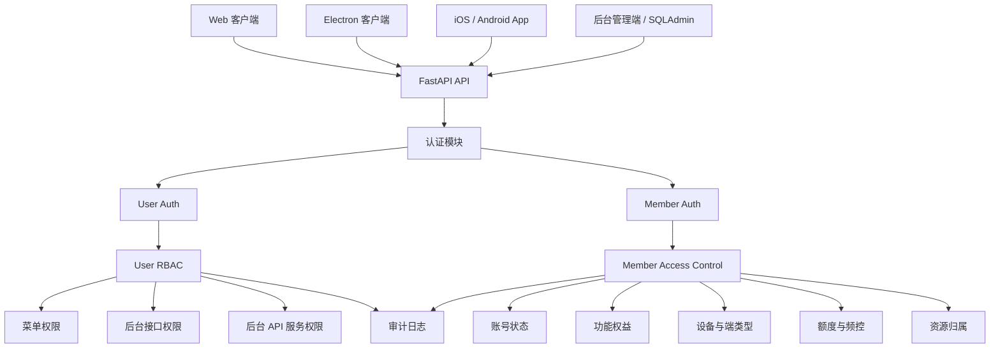

# 角色权限管理技术说明

版本：v0.1  
日期：2026-05-11  
适用范围：Python 服务端、Web 端、Electron 端、App 端、后台管理端  
对应系统：VO Mate / AI Creator Workbench

## 1. 设计目标

本系统需要同时支持后台管理权限和客户端产品权限。两类权限的用户对象、使用场景和判断规则不同，因此第一版 MVP 不应把所有账号都塞进同一个 RBAC 模型。

设计目标：

- Python 服务端提供统一认证、鉴权和权限策略入口。
- 后台管理端使用 `user` 身份，支持 RBAC、多角色、菜单权限、接口权限和 API 服务权限。
- 客户端产品端使用 `member` 身份，覆盖 Web、Electron、iOS、Android 等多端访问。
- 后台 `user` 可以管理、禁用、拉黑客户端 `member`，但二者身份域分离。
- 客户端权限不直接套后台 RBAC，而是由账号状态、套餐能力、端类型、设备、额度、资源归属和风控规则共同决定。
- 所有敏感操作需要记录审计日志，便于后续追踪责任和安全复盘。

核心原则：

```text
User RBAC = 后台管理权限
Member Access Control = 客户端产品权限
Shared Audit = 操作审计和安全日志
```

## 2. 身份域划分

### 2.1 后台管理身份：user

`user` 是 Python 服务端、SQLAdmin、运营后台和内部管理系统的操作者。

典型用户：

- 超级管理员。
- 系统管理员。
- 内容运营。
- 数据分析师。
- 客服或风控人员。
- 只读查看人员。

权限关注点：

- 是否可以进入后台。
- 能看到哪些后台菜单。
- 能调用哪些后台 API。
- 能管理哪些资源。
- 能否禁用、拉黑、恢复客户端用户。
- 能否修改系统配置、模型配置、平台配置。
- 能否导出数据或查看敏感字段。

`user` 适合使用标准 RBAC：

```text
user -> user_roles -> role -> role_permissions -> permission
```

### 2.2 客户端身份：member

`member` 是产品客户端用户，来自 Web、Electron、App 等端。

典型用户：

- 个人创作者。
- 团队成员。
- 内容运营协作者。
- 工作区成员。
- 试用用户。
- 付费用户。

权限关注点：

- 是否可以登录。
- 是否被禁用、拉黑或临时封禁。
- 是否允许当前端类型访问。
- 是否绑定合法设备。
- 是否拥有某个功能能力。
- 是否有足够额度调用 AI、采集、导出等能力。
- 是否有权限访问某个 workspace、平台账号、内容资产或任务。

`member` 不建议直接使用后台 RBAC。客户端权限更像产品访问控制，应由多种业务条件综合判断：

```text
member status + plan entitlement + client type + device + resource ownership + quota + risk rule
```

### 2.3 user 与 member 的边界

必须遵守以下边界：

- `user` 和 `member` 分表、分认证入口、分 token scope。
- 后台接口只接受 `subjectType=user` 的 token。
- 客户端接口只接受 `subjectType=member` 的 token。
- `member` 不能直接访问后台菜单、SQLAdmin 或管理 API。
- `user` 不能用自己的后台 token 调用客户端业务接口，除非后续设计专门的代客排查或模拟登录机制。
- 后台 `user` 对 `member` 的管理动作必须进入审计日志。

## 3. 总体架构



推荐后端模块：

```text
backend/app/
  core/
    security.py
    permissions.py
  api/v1/
    auth.py
    admin_auth.py
    admin_rbac.py
    admin_members.py
    member_auth.py
    member_access.py
  db/
    models.py
  schemas/
    auth.py
    rbac.py
    members.py
  services/
    auth/
      user_auth_service.py
      member_auth_service.py
      token_service.py
    rbac/
      permission_service.py
      menu_service.py
    access/
      member_access_service.py
      entitlement_service.py
      quota_service.py
    audit/
      audit_service.py
```

MVP 阶段也可以先不拆这么细，但依赖入口建议从一开始明确：

```python
get_current_user()
get_current_member()
require_user_permission("admin.member.disable")
require_member_active()
require_member_feature("ai_generate")
require_workspace_member("ws_xxx")
```

## 4. 后台 user RBAC

### 4.1 权限模型

后台 RBAC 由以下对象组成：

| 对象 | 说明 |
| --- | --- |
| `user` | 后台管理用户 |
| `role` | 后台角色，可分配给多个 user |
| `permission` | 权限点，描述某个资源上的动作 |
| `user_role` | user 与 role 的多对多关系 |
| `role_permission` | role 与 permission 的多对多关系 |
| `admin_menu` | 后台菜单树 |
| `menu_permission` | 菜单可见性与权限点的关系 |
| `api_permission` | 后台接口与权限点的关系 |

权限不建议只按 URL 存储。推荐使用稳定权限编码：

```text
admin.dashboard.read
admin.member.read
admin.member.disable
admin.member.blacklist
admin.member.restore
admin.rbac.user.manage
admin.rbac.role.manage
admin.rbac.permission.manage
admin.content.review
admin.content.export
admin.system.config.read
admin.system.config.update
admin.collector.task.manage
admin.ai.provider.manage
```

权限编码建议采用：

```text
<scope>.<resource>.<action>
```

示例：

```text
admin.member.read
admin.member.update
admin.member.disable
admin.member.blacklist
admin.member.export
```

### 4.2 角色设计

MVP 默认角色建议：

| 角色编码 | 角色名称 | 说明 |
| --- | --- | --- |
| `owner` | 超级管理员 | 拥有全部权限，可管理系统级配置和所有角色 |
| `admin` | 管理员 | 可管理大部分业务数据，不可修改高危系统配置 |
| `operator` | 运营 | 可查看内容、任务、成员数据，可执行内容运营动作 |
| `support` | 客服 | 可查看 member 信息，可禁用或临时封禁，但不能改系统配置 |
| `analyst` | 数据分析师 | 只读访问数据看板、内容指标和导出权限按需开启 |
| `viewer` | 只读人员 | 仅查看后台基础页面 |

注意：

- 一个 `user` 可以拥有多个角色。
- 最终权限是多个角色权限的并集。
- 高危权限不要默认给普通管理员，例如角色管理、系统配置、永久拉黑、数据导出。
- `owner` 可作为内置超级角色，但仍建议保留显式权限点，避免后续逻辑分叉过多。

### 4.3 菜单权限

菜单权限只决定后台是否显示某个菜单，不等同于接口权限。

示例菜单树：

```text
dashboard
members
  member.list
  member.detail
  member.blacklist
content
  content.list
  content.review
  content.export
collector
  collector.tasks
ai
  ai.providers
system
  rbac.users
  rbac.roles
  rbac.permissions
  system.settings
```

`admin_menu` 建议字段：

| 字段 | 类型 | 说明 |
| --- | --- | --- |
| `id` | string | 菜单 ID |
| `parent_id` | string/null | 父菜单 ID |
| `code` | string | 菜单编码 |
| `title` | string | 菜单名称 |
| `path` | string | 前端路由 |
| `icon` | string/null | 图标编码 |
| `sort_order` | int | 排序 |
| `is_visible` | bool | 是否显示 |
| `is_enabled` | bool | 是否启用 |
| `required_permission_code` | string/null | 可见所需权限 |

后台菜单返回流程：

```text
当前 user -> roles -> permissions -> 过滤 admin_menu -> 返回菜单树
```

### 4.4 接口权限

接口权限必须在服务端强制判断，不能只依赖前端隐藏菜单。

接口权限映射示例：

| Method | Path | Permission |
| --- | --- | --- |
| `GET` | `/api/v1/admin/members` | `admin.member.read` |
| `GET` | `/api/v1/admin/members/{memberId}` | `admin.member.read` |
| `POST` | `/api/v1/admin/members/{memberId}/disable` | `admin.member.disable` |
| `POST` | `/api/v1/admin/members/{memberId}/blacklist` | `admin.member.blacklist` |
| `POST` | `/api/v1/admin/members/{memberId}/restore` | `admin.member.restore` |
| `GET` | `/api/v1/admin/rbac/roles` | `admin.rbac.role.read` |
| `POST` | `/api/v1/admin/rbac/roles` | `admin.rbac.role.manage` |
| `PATCH` | `/api/v1/admin/system/settings` | `admin.system.config.update` |

FastAPI 中建议使用依赖声明：

```python
@router.post("/admin/members/{member_id}/disable")
async def disable_member(
    member_id: str,
    current_user: User = Depends(require_user_permission("admin.member.disable")),
):
    ...
```

### 4.5 API 服务权限

API 服务权限用于控制更细粒度或非菜单化能力，例如：

- 导出数据。
- 批量操作。
- 调用 AI 管理接口。
- 查看敏感配置。
- 读取外部平台 token 摘要。
- 触发采集任务重跑。

这类权限不一定有对应菜单，但必须有独立权限编码。

示例：

```text
admin.content.export
admin.collector.task.retry
admin.platform_account.secret.read
admin.ai.cost.read
admin.audit.read
```

## 5. 客户端 member 访问控制

### 5.1 member 状态

`member` 账号状态建议不要只用 `is_active`。MVP 推荐使用明确枚举：

```text
active
disabled
blacklisted
suspended
pending
deleted
```

状态含义：

| 状态 | 说明 | 是否允许登录 | 是否允许 API |
| --- | --- | --- | --- |
| `active` | 正常账号 | 是 | 是 |
| `disabled` | 管理员禁用，可恢复 | 否 | 否 |
| `blacklisted` | 拉黑，通常为严重违规 | 否 | 否 |
| `suspended` | 临时封禁，到期可恢复 | 视到期时间 | 视到期时间 |
| `pending` | 待验证或待开通 | 受限 | 受限 |
| `deleted` | 逻辑删除 | 否 | 否 |

建议额外字段：

| 字段 | 类型 | 说明 |
| --- | --- | --- |
| `status` | string | 当前状态 |
| `disabled_reason` | string/null | 禁用原因 |
| `blacklist_reason` | string/null | 拉黑原因 |
| `suspended_until` | datetime/null | 临时封禁截止时间 |
| `risk_level` | string | 风险等级 |
| `last_login_at` | datetime/null | 最近登录时间 |

### 5.2 member 权限判断链路

客户端接口建议统一经过以下判断链路：

```text
1. token 是否有效
2. subjectType 是否为 member
3. member 是否存在
4. member 是否 active 或符合受限访问条件
5. clientType 是否被允许
6. deviceId 是否有效或是否超过设备限制
7. workspace 权限是否满足
8. feature entitlement 是否满足
9. quota / rate limit 是否满足
10. 目标资源是否属于该 member 或其 workspace
```

示例：AI 生成接口

```text
POST /api/v1/ai/generate

需要满足：
- member token 有效。
- member.status = active。
- clientType in web/electron/app allowed list。
- member 拥有 ai_generate 功能权益。
- 当前 workspace 可访问。
- 今日 AI 调用额度未耗尽。
- 请求中的内容资源属于当前 workspace。
```

### 5.3 功能权益

客户端功能建议使用独立功能编码：

```text
ai_generate
ai_script_generate
ai_title_generate
content_import
content_export
collector_upload
collector_task_create
platform_account_bind
memory_search
team_invite
report_generate
```

功能权益来源可以是：

- 套餐。
- 工作区版本。
- 管理员单独授权。
- 灰度开关。
- 风控限制。

MVP 表结构可以先简单设计：

| 表 | 说明 |
| --- | --- |
| `member_feature_entitlements` | member 或 workspace 拥有的功能能力 |
| `member_usage_quotas` | 功能额度和使用量 |
| `client_feature_flags` | 不同客户端类型是否开放某功能 |

### 5.4 多端 clientType

所有客户端请求都应带上端类型，服务端从 token 或请求头中确定：

```text
web
electron
ios
android
browser_extension
```

建议 token 中包含：

```json
{
  "sub": "m_123",
  "subjectType": "member",
  "clientType": "electron",
  "deviceId": "dev_xxx",
  "workspaceId": "ws_xxx",
  "scopes": ["member:api"]
}
```

端类型用途：

- 控制某功能是否对该端开放。
- 区分 Electron 采集端和普通 Web 端。
- 限制高风险端调用敏感接口。
- 做设备管理、登录记录和安全审计。

### 5.5 设备与登录

Electron 和 App 端建议引入 `deviceId`，Web 端可以使用 session 或浏览器指纹的弱绑定。

`member_devices` 建议字段：

| 字段 | 类型 | 说明 |
| --- | --- | --- |
| `id` | string | 设备 ID |
| `member_id` | string | member ID |
| `client_type` | string | 端类型 |
| `device_name` | string/null | 设备名称 |
| `device_fingerprint` | string/null | 设备指纹摘要 |
| `trusted` | bool | 是否可信设备 |
| `last_seen_at` | datetime/null | 最近活跃时间 |
| `revoked_at` | datetime/null | 是否被吊销 |

设备控制策略：

- `disabled` 或 `blacklisted` 的 member 应吊销所有 refresh token。
- 管理员可以强制下线某个 member 的全部设备。
- Electron 采集端可设置更严格的设备校验。
- 高危操作可要求重新登录或二次确认。

## 6. Token 与认证

### 6.1 token 类型

建议至少区分：

| 类型 | 用途 | subjectType | scope |
| --- | --- | --- | --- |
| 后台 access token | 后台管理 API | `user` | `admin:api` |
| 客户端 access token | 产品 API | `member` | `member:api` |
| refresh token | 刷新登录态 | `user` 或 `member` | `auth:refresh` |
| service token | 内部服务调用，后续阶段使用 | `service` | `service:api` |

后台 user token 示例：

```json
{
  "sub": "u_123",
  "subjectType": "user",
  "scopes": ["admin:api"],
  "roles": ["owner"],
  "iat": 1778486400,
  "exp": 1778490000
}
```

客户端 member token 示例：

```json
{
  "sub": "m_123",
  "subjectType": "member",
  "clientType": "web",
  "deviceId": "dev_123",
  "workspaceId": "ws_123",
  "scopes": ["member:api"],
  "iat": 1778486400,
  "exp": 1778490000
}
```

### 6.2 服务端校验规则

后台接口：

```text
必须满足：
- token 有效。
- subjectType = user。
- scopes 包含 admin:api。
- user.status = active。
- user 拥有目标 permission。
```

客户端接口：

```text
必须满足：
- token 有效。
- subjectType = member。
- scopes 包含 member:api。
- member 状态允许访问。
- 当前 clientType、deviceId、workspace、feature、quota、resource 均满足要求。
```

禁止：

- 使用 member token 调用 `/api/v1/admin/**`。
- 使用 user token 直接调用客户端业务接口。
- 只在前端判断权限。
- 把角色名称当作接口权限判断的唯一依据。

### 6.3 Token 失效策略

以下情况应立即让相关 token 失效：

- `member` 被禁用。
- `member` 被拉黑。
- `member` 被临时封禁。
- `user` 被禁用。
- 角色权限发生高危变化。
- 设备被吊销。
- 用户修改密码。

MVP 可以先使用短 access token + refresh token 黑名单，后续再引入 Redis 存储 token version 或 revoke list。

建议字段：

| 字段 | 所属对象 | 说明 |
| --- | --- | --- |
| `token_version` | `user` / `member` | 递增后旧 token 全部失效 |
| `password_changed_at` | `user` / `member` | 早于该时间签发的 token 无效 |
| `revoked_at` | `member_device` | 设备被吊销时间 |

## 7. 数据库表设计建议

### 7.1 后台 RBAC 表

#### users

| 字段 | 类型 | 说明 |
| --- | --- | --- |
| `id` | string | 后台用户 ID，建议 `u_` 前缀 |
| `username` | string | 登录名 |
| `email` | string/null | 邮箱 |
| `password_hash` | string | 密码哈希 |
| `display_name` | string | 显示名称 |
| `status` | string | `active` / `disabled` |
| `token_version` | int | token 版本 |
| `last_login_at` | datetime/null | 最近登录 |
| `created_at` | datetime | 创建时间 |
| `updated_at` | datetime | 更新时间 |

#### roles

| 字段 | 类型 | 说明 |
| --- | --- | --- |
| `id` | string | 角色 ID |
| `code` | string | 角色编码 |
| `name` | string | 角色名称 |
| `description` | string/null | 描述 |
| `is_system` | bool | 是否系统内置角色 |
| `is_enabled` | bool | 是否启用 |
| `created_at` | datetime | 创建时间 |
| `updated_at` | datetime | 更新时间 |

#### permissions

| 字段 | 类型 | 说明 |
| --- | --- | --- |
| `id` | string | 权限 ID |
| `code` | string | 权限编码 |
| `name` | string | 权限名称 |
| `resource` | string | 资源 |
| `action` | string | 动作 |
| `scope` | string | `admin` |
| `description` | string/null | 描述 |
| `is_enabled` | bool | 是否启用 |

#### user_roles

| 字段 | 类型 | 说明 |
| --- | --- | --- |
| `user_id` | string | 后台用户 ID |
| `role_id` | string | 角色 ID |
| `assigned_by` | string/null | 分配人 |
| `assigned_at` | datetime | 分配时间 |

#### role_permissions

| 字段 | 类型 | 说明 |
| --- | --- | --- |
| `role_id` | string | 角色 ID |
| `permission_id` | string | 权限 ID |
| `assigned_by` | string/null | 分配人 |
| `assigned_at` | datetime | 分配时间 |

#### admin_menus

| 字段 | 类型 | 说明 |
| --- | --- | --- |
| `id` | string | 菜单 ID |
| `parent_id` | string/null | 父菜单 ID |
| `code` | string | 菜单编码 |
| `title` | string | 菜单标题 |
| `path` | string | 前端路由 |
| `icon` | string/null | 图标 |
| `sort_order` | int | 排序 |
| `required_permission_code` | string/null | 菜单所需权限 |
| `is_visible` | bool | 是否可见 |
| `is_enabled` | bool | 是否启用 |

#### api_permissions

| 字段 | 类型 | 说明 |
| --- | --- | --- |
| `id` | string | 映射 ID |
| `method` | string | HTTP Method |
| `path_pattern` | string | 路由模式 |
| `permission_code` | string | 所需权限 |
| `description` | string/null | 描述 |
| `is_enabled` | bool | 是否启用 |

### 7.2 客户端 member 表

#### members

| 字段 | 类型 | 说明 |
| --- | --- | --- |
| `id` | string | 客户端用户 ID，建议 `m_` 前缀 |
| `email` | string/null | 邮箱 |
| `phone` | string/null | 手机号 |
| `password_hash` | string/null | 密码哈希 |
| `display_name` | string | 显示名称 |
| `avatar_url` | string/null | 头像 |
| `status` | string | 账号状态 |
| `risk_level` | string | 风险等级 |
| `suspended_until` | datetime/null | 临时封禁截止 |
| `token_version` | int | token 版本 |
| `last_login_at` | datetime/null | 最近登录 |
| `created_at` | datetime | 创建时间 |
| `updated_at` | datetime | 更新时间 |

#### member_status_logs

| 字段 | 类型 | 说明 |
| --- | --- | --- |
| `id` | string | 日志 ID |
| `member_id` | string | member ID |
| `from_status` | string/null | 原状态 |
| `to_status` | string | 新状态 |
| `reason` | string/null | 原因 |
| `operator_user_id` | string/null | 后台操作者 |
| `created_at` | datetime | 操作时间 |

#### member_blacklist_entries

| 字段 | 类型 | 说明 |
| --- | --- | --- |
| `id` | string | 拉黑记录 ID |
| `member_id` | string | member ID |
| `reason` | string | 拉黑原因 |
| `evidence` | json/null | 证据或备注 |
| `operator_user_id` | string | 操作者 |
| `expires_at` | datetime/null | 过期时间，空表示长期 |
| `revoked_at` | datetime/null | 解除时间 |
| `created_at` | datetime | 创建时间 |

#### member_devices

| 字段 | 类型 | 说明 |
| --- | --- | --- |
| `id` | string | 设备 ID |
| `member_id` | string | member ID |
| `client_type` | string | 客户端类型 |
| `device_name` | string/null | 设备名称 |
| `device_fingerprint` | string/null | 指纹摘要 |
| `trusted` | bool | 是否可信 |
| `last_seen_at` | datetime/null | 最近访问 |
| `revoked_at` | datetime/null | 吊销时间 |
| `created_at` | datetime | 创建时间 |

#### member_feature_entitlements

| 字段 | 类型 | 说明 |
| --- | --- | --- |
| `id` | string | 权益 ID |
| `member_id` | string/null | member ID |
| `workspace_id` | string/null | workspace ID |
| `feature_code` | string | 功能编码 |
| `source` | string | `plan` / `manual` / `trial` / `system` |
| `is_enabled` | bool | 是否启用 |
| `starts_at` | datetime/null | 开始时间 |
| `expires_at` | datetime/null | 过期时间 |

#### member_usage_quotas

| 字段 | 类型 | 说明 |
| --- | --- | --- |
| `id` | string | 额度 ID |
| `member_id` | string/null | member ID |
| `workspace_id` | string/null | workspace ID |
| `feature_code` | string | 功能编码 |
| `period` | string | `daily` / `monthly` / `total` |
| `quota_limit` | int | 限额 |
| `quota_used` | int | 已使用 |
| `reset_at` | datetime/null | 重置时间 |

#### client_feature_flags

| 字段 | 类型 | 说明 |
| --- | --- | --- |
| `id` | string | 配置 ID |
| `client_type` | string | `web` / `electron` / `ios` / `android` |
| `feature_code` | string | 功能编码 |
| `is_enabled` | bool | 是否开放 |
| `min_version` | string/null | 最低客户端版本 |
| `description` | string/null | 描述 |

### 7.3 审计表

#### audit_logs

| 字段 | 类型 | 说明 |
| --- | --- | --- |
| `id` | string | 审计 ID |
| `actor_type` | string | `user` / `member` / `service` |
| `actor_id` | string | 操作者 ID |
| `action` | string | 操作编码 |
| `target_type` | string | 目标类型 |
| `target_id` | string | 目标 ID |
| `result` | string | `success` / `failed` |
| `ip_address` | string/null | IP |
| `user_agent` | string/null | UA |
| `metadata` | json/null | 附加信息 |
| `created_at` | datetime | 创建时间 |

审计动作示例：

```text
admin.member.disable
admin.member.blacklist
admin.member.restore
admin.rbac.role.create
admin.rbac.role.update_permissions
admin.user.disable
member.login
member.logout
member.device.revoke
member.feature.use
```

## 8. API 设计建议

### 8.1 后台认证

```text
POST /api/v1/admin/auth/login
POST /api/v1/admin/auth/logout
POST /api/v1/admin/auth/refresh
GET  /api/v1/admin/auth/me
GET  /api/v1/admin/auth/menus
```

`GET /api/v1/admin/auth/me` 返回：

```json
{
  "id": "u_123",
  "username": "admin",
  "displayName": "管理员",
  "roles": ["owner"],
  "permissions": ["admin.member.read", "admin.member.disable"]
}
```

### 8.2 后台 RBAC

```text
GET    /api/v1/admin/rbac/users
POST   /api/v1/admin/rbac/users
PATCH  /api/v1/admin/rbac/users/{userId}
POST   /api/v1/admin/rbac/users/{userId}/disable

GET    /api/v1/admin/rbac/roles
POST   /api/v1/admin/rbac/roles
PATCH  /api/v1/admin/rbac/roles/{roleId}
DELETE /api/v1/admin/rbac/roles/{roleId}
PUT    /api/v1/admin/rbac/roles/{roleId}/permissions

GET    /api/v1/admin/rbac/permissions
GET    /api/v1/admin/rbac/menus
PATCH  /api/v1/admin/rbac/menus/{menuId}
```

### 8.3 member 管理

```text
GET  /api/v1/admin/members
GET  /api/v1/admin/members/{memberId}
POST /api/v1/admin/members/{memberId}/disable
POST /api/v1/admin/members/{memberId}/suspend
POST /api/v1/admin/members/{memberId}/blacklist
POST /api/v1/admin/members/{memberId}/restore
GET  /api/v1/admin/members/{memberId}/devices
POST /api/v1/admin/members/{memberId}/devices/{deviceId}/revoke
GET  /api/v1/admin/members/{memberId}/audit-logs
```

禁用请求示例：

```json
{
  "reason": "违反平台使用规则",
  "revokeAllTokens": true
}
```

临时封禁请求示例：

```json
{
  "reason": "异常批量调用",
  "suspendedUntil": "2026-05-18T00:00:00+08:00",
  "revokeAllTokens": true
}
```

### 8.4 客户端认证

```text
POST /api/v1/member/auth/register
POST /api/v1/member/auth/login
POST /api/v1/member/auth/logout
POST /api/v1/member/auth/refresh
GET  /api/v1/member/auth/me
GET  /api/v1/member/access/features
GET  /api/v1/member/access/quotas
```

客户端登录请求建议包含：

```json
{
  "account": "creator@example.com",
  "password": "******",
  "clientType": "electron",
  "deviceId": "dev_xxx",
  "deviceName": "MacBook Pro"
}
```

`GET /api/v1/member/auth/me` 返回：

```json
{
  "id": "m_123",
  "displayName": "创作者 A",
  "status": "active",
  "currentWorkspaceId": "ws_123",
  "clientType": "electron",
  "features": ["ai_generate", "collector_upload", "memory_search"]
}
```

## 9. 鉴权依赖与服务实现

### 9.1 后台权限依赖

推荐依赖：

```python
def require_user_permission(permission_code: str):
    async def dependency(
        current_user: User = Depends(get_current_user),
    ) -> User:
        if not current_user.is_active:
            raise HTTPException(status_code=403, detail="User disabled")

        permissions = await permission_service.get_user_permissions(current_user.id)
        if permission_code not in permissions:
            raise HTTPException(status_code=403, detail="Permission denied")

        return current_user

    return dependency
```

后台接口中使用：

```python
@router.post("/admin/members/{member_id}/blacklist")
async def blacklist_member(
    member_id: str,
    payload: BlacklistMemberRequest,
    current_user: User = Depends(require_user_permission("admin.member.blacklist")),
):
    ...
```

### 9.2 客户端访问依赖

推荐依赖：

```python
def require_member_feature(feature_code: str):
    async def dependency(
        current_member: Member = Depends(get_current_member),
        client_context: ClientContext = Depends(get_client_context),
    ) -> Member:
        await member_access_service.ensure_active(current_member)
        await member_access_service.ensure_client_allowed(
            member=current_member,
            client_type=client_context.client_type,
            feature_code=feature_code,
        )
        await entitlement_service.ensure_feature_enabled(
            member_id=current_member.id,
            workspace_id=client_context.workspace_id,
            feature_code=feature_code,
        )
        await quota_service.ensure_quota_available(
            member_id=current_member.id,
            workspace_id=client_context.workspace_id,
            feature_code=feature_code,
        )
        return current_member

    return dependency
```

客户端接口中使用：

```python
@router.post("/ai/generate")
async def generate_content(
    payload: GenerateRequest,
    current_member: Member = Depends(require_member_feature("ai_generate")),
):
    ...
```

### 9.3 资源归属判断

所有访问具体业务资源的接口都需要判断资源归属，例如：

- workspace 是否属于当前 member。
- platform account 是否属于当前 workspace。
- content item 是否属于当前 workspace。
- collector task 是否由当前 workspace 创建。

推荐依赖：

```python
async def require_workspace_access(
    workspace_id: str,
    current_member: Member = Depends(get_current_member),
) -> Workspace:
    ...
```

资源归属判断必须在服务端完成，客户端传入的 `workspaceId` 只能作为请求参数，不能直接信任。

## 10. 拉黑、禁用与恢复流程

### 10.1 禁用 member

适用场景：

- 用户违规但可恢复。
- 账号异常需要人工核查。
- 欠费或合同问题。

流程：

```text
1. 后台 user 调用禁用接口。
2. 服务端校验 user 是否拥有 admin.member.disable。
3. 更新 member.status = disabled。
4. token_version + 1 或吊销 refresh token。
5. 可选：吊销全部 member_devices。
6. 写入 member_status_logs。
7. 写入 audit_logs。
8. 后续 member 登录和 API 请求全部拒绝。
```

### 10.2 拉黑 member

适用场景：

- 恶意攻击。
- 批量滥用。
- 严重违规。
- 明确风控封禁。

流程：

```text
1. 后台 user 调用拉黑接口。
2. 服务端校验 user 是否拥有 admin.member.blacklist。
3. 写入 member_blacklist_entries。
4. 更新 member.status = blacklisted。
5. token_version + 1。
6. 吊销所有设备和 refresh token。
7. 写入 member_status_logs。
8. 写入 audit_logs。
9. 后续登录、刷新 token 和业务 API 全部拒绝。
```

### 10.3 临时封禁 member

适用场景：

- 短期异常调用。
- 风控冷却。
- 等待人工确认。

流程：

```text
1. 后台 user 调用临时封禁接口。
2. 设置 member.status = suspended。
3. 设置 suspended_until。
4. 根据策略吊销当前 token。
5. 到期后可自动恢复 active，或由后台手动恢复。
```

### 10.4 恢复 member

流程：

```text
1. 后台 user 调用恢复接口。
2. 服务端校验 user 是否拥有 admin.member.restore。
3. 判断是否允许从 disabled / suspended / blacklisted 恢复。
4. 更新 member.status = active。
5. 如是 blacklist，更新 blacklist entry 的 revoked_at。
6. 写入 member_status_logs。
7. 写入 audit_logs。
```

建议：

- 从 `disabled` 或 `suspended` 恢复可以给 `admin` 或 `support`。
- 从 `blacklisted` 恢复建议只给 `owner` 或特定风控角色。

## 11. 前端与多端协作

### 11.1 后台管理端

后台管理端应从服务端获取当前用户信息和菜单树：

```text
GET /api/v1/admin/auth/me
GET /api/v1/admin/auth/menus
```

前端职责：

- 根据菜单树渲染导航。
- 根据 permission 控制按钮显示。
- 对无权限页面做友好提示。

服务端职责：

- 对所有后台 API 做权限校验。
- 不依赖前端隐藏按钮作为安全边界。
- 返回清晰的 401 / 403 错误。

### 11.2 Web 客户端

Web 客户端使用 member 登录态：

- 登录时传 `clientType=web`。
- 访问业务接口使用 member token。
- 从 `/member/auth/me` 获取当前 workspace 和 feature 列表。
- 根据 feature 控制入口展示。

### 11.3 Electron 客户端

Electron 端通常权限更敏感，因为可能承担采集、上传、本地文件读取等能力。

建议：

- 登录时绑定 `deviceId`。
- token 中包含 `clientType=electron`。
- 采集上传接口单独要求 `collector_upload` 权益。
- 可对 Electron 设置独立最低版本和设备限制。
- 设备被吊销后禁止继续上传采集数据。

### 11.4 App 客户端

App 端可以与 Web 共用大部分 member API，但需要额外考虑：

- 移动端版本灰度。
- 功能分阶段开放。
- 推送 token 管理。
- App Store 或应用市场合规限制。

## 12. 错误码建议

建议统一错误码，方便多端处理：

| HTTP | code | 说明 |
| --- | --- | --- |
| 401 | `AUTH_TOKEN_MISSING` | token 缺失 |
| 401 | `AUTH_TOKEN_INVALID` | token 无效 |
| 401 | `AUTH_TOKEN_EXPIRED` | token 过期 |
| 403 | `AUTH_SUBJECT_TYPE_FORBIDDEN` | 身份类型不允许 |
| 403 | `USER_DISABLED` | 后台用户被禁用 |
| 403 | `USER_PERMISSION_DENIED` | 后台权限不足 |
| 403 | `MEMBER_DISABLED` | member 被禁用 |
| 403 | `MEMBER_BLACKLISTED` | member 被拉黑 |
| 403 | `MEMBER_SUSPENDED` | member 临时封禁 |
| 403 | `CLIENT_TYPE_FORBIDDEN` | 当前端类型不可用 |
| 403 | `DEVICE_REVOKED` | 设备已吊销 |
| 403 | `FEATURE_NOT_ENABLED` | 功能未开通 |
| 403 | `QUOTA_EXCEEDED` | 额度不足 |
| 403 | `RESOURCE_FORBIDDEN` | 资源无权访问 |

响应示例：

```json
{
  "detail": {
    "code": "FEATURE_NOT_ENABLED",
    "message": "当前账号未开通该功能",
    "featureCode": "ai_generate"
  }
}
```

## 13. MVP 落地步骤

### 13.1 第一阶段：打清身份边界

目标：

- 建立 `user` 与 `member` 两套身份模型。
- 后台 token 和客户端 token 明确区分。
- 后台接口和客户端接口按前缀分组。

建议任务：

- 新增或整理 `users`、`members` 表。
- 实现 `get_current_user()`。
- 实现 `get_current_member()`。
- token payload 加入 `subjectType`、`scopes`、`tokenVersion`。
- 后台接口统一放在 `/api/v1/admin/**`。
- 客户端接口统一放在 `/api/v1/member/**` 或现有业务路径中强制 member 鉴权。

验收标准：

- member token 访问后台接口返回 403。
- user token 访问客户端接口返回 403。
- disabled user 不能进入后台。
- disabled member 不能访问客户端 API。

### 13.2 第二阶段：实现后台 RBAC

目标：

- 后台 user 支持多角色。
- 后台菜单和接口使用 permission 控制。

建议任务：

- 建立 `roles`、`permissions`、`user_roles`、`role_permissions`。
- 建立默认角色和权限种子数据。
- 实现 `require_user_permission()`。
- 实现 `/admin/auth/me` 和 `/admin/auth/menus`。
- 为 member 管理接口接入权限依赖。
- SQLAdmin 或后台页面中可以管理角色和权限。

验收标准：

- 不同角色看到不同菜单。
- 无权限调用后台接口返回 403。
- 一个 user 多角色权限可叠加。
- 角色权限变更后能影响后续请求。

### 13.3 第三阶段：实现 member access control

目标：

- 客户端 member 支持账号状态、功能权益、端类型、设备和额度判断。

建议任务：

- 扩展 `members.status`、`risk_level`、`token_version`。
- 建立 `member_devices`。
- 建立 `member_feature_entitlements`。
- 建立 `member_usage_quotas`。
- 建立 `client_feature_flags`。
- 实现 `require_member_active()`。
- 实现 `require_member_feature()`。
- 先给核心功能接入功能权益判断，例如 AI 生成、采集上传、数据导出。

验收标准：

- blacklisted member 无法登录和调用 API。
- Electron 端可被单独限制某个功能。
- 未开通功能的 member 调用接口返回 `FEATURE_NOT_ENABLED`。
- 超额度调用返回 `QUOTA_EXCEEDED`。

### 13.4 第四阶段：审计与安全收口

目标：

- 高危操作可追踪。
- 禁用、拉黑、恢复、角色变更都有记录。

建议任务：

- 建立 `audit_logs`。
- 建立 `member_status_logs`。
- 拉黑记录写入 `member_blacklist_entries`。
- 后台高危接口统一写审计。
- 登录、登出、刷新 token、设备吊销可按需写安全日志。

验收标准：

- 可以查询某个 member 被谁、何时、为什么禁用或拉黑。
- 可以查询某个 role 的权限变更历史。
- 可以查询某个后台 user 的关键操作历史。

## 14. 实施注意事项

- 不要把后台 `user` 和客户端 `member` 合并成一张账号表，避免后续权限污染。
- 不要用角色名直接判断权限，应该判断 permission code。
- 不要把客户端套餐和后台 RBAC 混在一起。
- 不要只做前端菜单隐藏，接口必须服务端校验。
- 不要在 token 中放过多动态权限，权限变更后容易失效不及时。token 中放身份和 scope，权限从服务端读取或缓存。
- Redis 未配置时，MVP 可以先不用集中 token 黑名单，但 `token_version` 字段应预留。
- 权限缓存需要有失效策略，角色或权限变更后应清理当前 user 的权限缓存。
- 拉黑和禁用应吊销 refresh token，access token 可通过短有效期降低风险。
- 所有 ID 按字符串处理，避免多端和外部平台 ID 精度问题。
- `.env` 只保存配置，不保存固定账号密码示例；文档中所有密钥使用占位。

## 15. 后续扩展方向

MVP 稳定后可继续扩展：

- 团队和 workspace 级别角色，例如 workspace owner、editor、viewer。
- 更完整的 ABAC 策略，例如按资源所有者、部门、地区、数据敏感级别判断。
- 引入 Casbin 或 OPA，但应在自研权限边界稳定后再评估。
- 支持 API Key 权限，用于采集端、插件或第三方集成。
- 支持服务间 `service token`，给异步 worker 或内部服务使用。
- 支持操作审批流，例如导出数据、解除拉黑、修改系统配置。
- 支持权限变更 diff 和审计回放。
- 支持安全中心，集中展示登录设备、异常登录、风控记录和高危操作。

